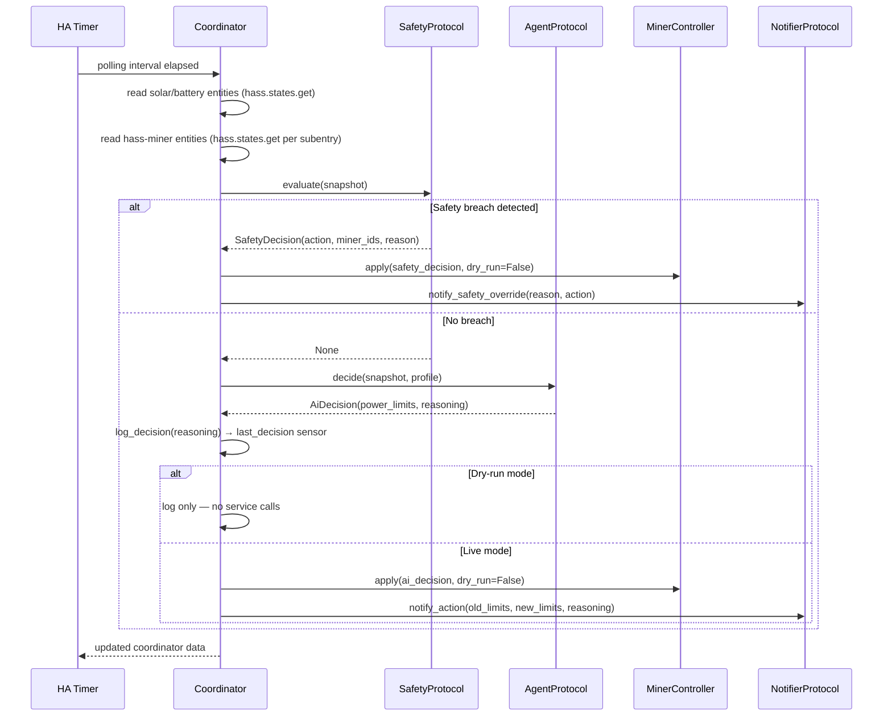
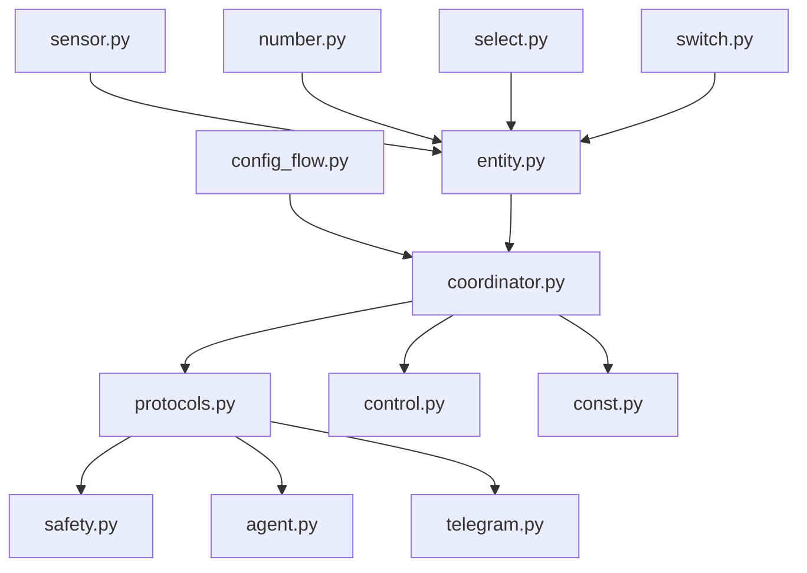

# feat: Solar Smart Miner — Home Assistant Integration

## Summary

Build a greenfield Home Assistant custom integration using `integration_blueprint` as the scaffold, organized around a single `DataUpdateCoordinator` that reads solar/battery/miner state from existing HA entities, passes it through a deterministic safety layer and then an OpenRouter AI agent, and applies power limit decisions back to hass-miner via HA service calls. All major components (agent, safety, notifier) are defined behind Protocol interfaces for clean extensibility.

---

## Progress

Check off each unit after it is implemented, tested, and merged.

- [x] **U1** — Project scaffold: devcontainer, manifest.json, const.py (with profile definitions), HACS, and pytest setup
- [x] **U2** — Configuration flow: setup wizard, OptionsFlow (runtime settings), and miner subentries
- [ ] **U3** — DataUpdateCoordinator: energy + miner state ingestion and full decision orchestration loop
- [ ] **U4** — Safety layer: deterministic temperature / battery SOC / solar fault overrides
- [ ] **U5** — AI decision engine: OpenRouter agent with profile-aware reasoning and decision log
- [ ] **U6** — Miner control: apply power limit decisions via hass-miner service calls with dry-run gate
- [ ] **U7** — HA entity platform files: sensors, profile selector, dry-run switch, last-decision display
- [ ] **U8** — Telegram notifier: optional action and safety override notifications
- [x] **U9** — Mock Solar Mode: substitute Forecast. Solar entity for real solar entity during development
- [ ] **U10** — Mock Consumption Meter: miner power sum sensor and mock grid consumption mode
- [x] **U11** — Minimal coordinator: entity reads and power limit control

---

## Problem Frame

Solar-powered ASIC miners waste opportunity by running at a fixed wattage regardless of actual solar production, battery state, or household consumption. Home Assistant already has mature solar and miner integrations; this plan connects them with an AI-driven controller. See [origin document](docs/brainstorms/solar-smart-miner-requirements.md) for the full problem frame, actors, and flows.

---

## Requirements

- R1–R4 Data ingestion: read solar production, grid consumption, battery SOC (optional), and per-miner sensors from HA entity state
- R5–R8 Safety layer: deterministic overrides for temperature ceiling, battery floor, and solar fault — bypass AI; fire even in dry-run mode
- R9–R13 AI decision engine: polling-based agent via OpenRouter, outputs power limit per miner, logs reasoning
- R14–R17 Dry-run mode: full decision cycle without applying changes; togglable without restart
- R18–R22 Profiles: battery-focused, solar-max, grid-agnostic, grid-independent; one active at a time
- R23–R25 Telegram notifications: optional; notify on AI-applied changes and safety overrides
- R26–R31 Development standards: Python, HA conventions, HACS distribution, pytest test suite, devcontainer

**Origin actors:** A1 (Miner operator), A2 (AI decision agent), A3 (Safety layer), A4 (hass-miner), A5 (HA solar integration), A6 (Telegram bot)

**Origin flows:** F1 (Normal decision cycle), F2 (Safety override), F3 (Profile switch)

**Origin acceptance examples:** AE1 (dry-run logs decision, no wattage change), AE2 (safety override fires despite dry-run), AE3 (grid-independent power cap), AE4 (battery-focused without battery entity), AE5 (dry-run toggle without restart)

---

## Scope Boundaries

### Deferred for later

- Event-triggered decisions (replace polling with HA state-change triggers — v2 upgrade path)
- Weather forecast integration
- Grid electricity price integration
- Multiple simultaneous profiles (per-miner profile assignment)
- Agent decision history UI in the HA frontend (beyond the last-decision sensor)
- Non-autotuning miner support (on/off only)

### Outside this product's identity

- Mining pool or coin-profitability switching
- Cloud or remote management beyond Telegram
- Direct solar vendor API integration (HA state only)
- General HA energy management beyond miner control

### Deferred to Follow-Up Work

- HACS default store submission (requires community usage, README polish, branding assets): separate PR after initial releases
- `docs/solutions/` learnings capture: after first real-world deployment

---

## Context & Research

### Relevant Code and Patterns

- `ludeeus/integration_blueprint` — canonical HA custom integration scaffold; use as GitHub template or direct copy
- `entry.runtime_data` — modern HA pattern for storing coordinator on the config entry (replaces `hass.data[DOMAIN][entry.entry_id]`)
- `DataUpdateCoordinator` — standard HA polling pattern; `_async_update_data()` is the single fetch point
- `async_config_entry_first_refresh()` — must complete before platforms are forwarded so entities never register with `None` data
- Config subentry API — `async_get_supported_subentry_types()` + `ConfigSubentryFlow` — recommended for N sub-devices (miners) under one parent config entry
- `OptionsFlow` + `reconfigure` step — runtime settings without restart (`OptionsFlow`); connection-level changes via `reconfigure`
- hass-miner entities: `number.<miner>_power_limit` (writable), `sensor.<miner>_*` (hashrate, power, efficiency, temp, board temps)
- `hass.services.async_call("number", "set_value", {...})` — how to write to hass-miner power limit from within the integration

### Institutional Learnings

- No `docs/solutions/` directory yet — this project is net-new; capture learnings after first deployment

### External References

- [HA Integration Manifest](https://developers.home-assistant.io/docs/creating_integration_manifest/)
- [DataUpdateCoordinator docs](https://developers.home-assistant.io/docs/integration_fetching_data/)
- [Config flow handler](https://developers.home-assistant.io/docs/config_entries_config_flow_handler/)
- [Number entity](https://developers.home-assistant.io/docs/core/entity/number/) / [Select entity](https://developers.home-assistant.io/docs/core/entity/select/) / [Sensor entity](https://developers.home-assistant.io/docs/core/entity/sensor/)
- [OpenRouter Chat Completions API](https://openrouter.ai/docs/api-reference/chat-completions) — direct HTTP POST; `Authorization: Bearer <key>`; same JSON body shape as OpenAI `/v1/chat/completions`
- [pytest-homeassistant-custom-component](https://github.com/MatthewFlamm/pytest-homeassistant-custom-component)
- [HACS publish requirements](https://www.hacs.xyz/docs/publish/integration/)

---

## Key Technical Decisions

- **Protocol interfaces for swappable components:** `AgentProtocol`, `NotifierProtocol`, and `SafetyProtocol` (Python `typing.Protocol`) define the contracts the coordinator depends on. Concrete implementations (OpenRouter agent, Telegram notifier, default safety rules) are injected at startup. This makes it trivial to add a Slack notifier, swap to a local LLM, or add new safety rules without touching the coordinator.
- **Single coordinator reads all HA state:** Solar entities and hass-miner entities are both just HA state reads (`hass.states.get(entity_id)`); there is no separate data fetcher per source. The coordinator holds the full snapshot per poll cycle.
- **Safety layer runs before AI, always:** In `_async_update_data`, safety is evaluated first. If any constraint fires, the AI call is skipped entirely and the override is applied. Safety overrides bypass dry-run (R16).
- **AI agent invoked inline in coordinator:** The OpenRouter call happens inside `_async_update_data`, bounded by a configurable timeout (default 10s). On timeout or parse failure the coordinator logs a warning and maintains the current power limit (safe fallback).
- **Config subentries for miners:** The parent config entry stores global settings (solar entities, OpenRouter key/model, safety thresholds, profile, polling interval). Each miner is a subentry with its IP and display name. This is the current HA-recommended approach for integrations managing N sub-devices.
- **OptionsFlow for all runtime tunables:** Dry-run toggle, polling interval, safety thresholds, and active profile are all in `OptionsFlow` — changes take effect on the next poll without an HA restart.
- **Decision log as text sensor:** `sensor.solar_smart_miner_last_decision` holds the most recent decision text; `extra_state_attributes` carries the full reasoning. HA logbook captures history via state change events. No custom persistence needed.
- **Telegram via aiohttp directly:** HA already depends on `aiohttp`; no extra pip dependency needed for Telegram Bot API HTTP calls. The notifier is a no-op when token/chat_id are absent.
- **Profile definitions in `const.py`:** Profiles are data structures (name, description, parameters), not hardcoded in the AI prompt. The prompt receives the active profile's parameters at runtime. Adding a new profile is a `const.py` change only.
- **`integration_blueprint` as the scaffold:** Fork or copy-initialize from `ludeeus/integration_blueprint` to get correct file layout, CI stubs, `devcontainer.json`, and pytest setup out of the box.

---

## Open Questions

### Resolved During Planning

- **Optional vs required entity mapping in config flow:** Multi-step flow — step 1 collects required fields (solar production entity, grid consumption entity, OpenRouter key/model); step 2 collects optional battery SOC entity; miner subentries are added independently after initial setup.
- **One config entry vs N miners:** Config subentry pattern — one parent entry, N miner subentries, each scoped to the parent entry's unique ID.
- **pytest-homeassistant-custom-component mocking depth:** Full HA instance in the test event loop; `MockConfigEntry` for config entries; `patch()` for external API calls (OpenRouter, Telegram); `aioclient_mock` for aiohttp. Sufficient for all coordinator, entity, and flow tests.

### Deferred to Implementation

- **Exact OpenRouter prompt template wording:** Iterative tuning needed after running dry-run on real hardware; cannot be finalized in planning.
- **Min/max power limit source per miner:** hass-miner exposes these as entity attributes; implementation should read them dynamically rather than hardcoding. Verify attribute names during coding against a live hass-miner instance.
- **Profile parameter values (thresholds):** Default threshold values for each profile (e.g., battery-focused "reduce at 60%, stop at 20%") need real-world tuning. Defaults in `const.py` should be conservative and user-overridable via OptionsFlow.
- **[Affects R9 / dev-env] CGMiner mock server:** No existing tool is specified for mocking the CGMiner RPC protocol that `pyasic` speaks — needed for hardware-free integration testing (dev-env requirements R9, R10). Options to evaluate during U1: a lightweight Python stub server, an existing open-source CGMiner simulator, or a `pyasic` test fixture exposed as a network endpoint at `host.docker.internal:<port>`.
- **[Affects Key Technical Decisions] [Design]** Protocol interfaces (`AgentProtocol`, `NotifierProtocol`, `SafetyProtocol`) each currently have a single concrete implementation. Decide explicitly before starting U3 implementation: keep the Protocol abstraction for future swap-in extensibility (as designed), or remove Protocols and use concrete types directly to reduce indirection. The user has expressed a preference for modular, swappable components, but the scope-guardian flagged this as potential YAGNI if no second implementation is planned for v1.
- **[Affects U10] Exact hass-miner device attribute for IP matching:** Which attribute on the device registry entry holds the miner's IP — `configuration_url`, `connections` (set of tuples), or `identifiers`. Verify against a live hass-miner instance during U10 implementation.
- **[Affects U10] hass-miner power entity selection:** Which sensor entity represents power consumption (watts) when hass-miner registers multiple sensors per miner. Filter candidates by `device_class == SensorDeviceClass.POWER` and `unit_of_measurement == "W"`, but confirm exact naming at implementation time.

---

## Output Structure

```
solar-smart-miner/
├── hacs.json
├── pyproject.toml
├── requirements.txt
├── .devcontainer.json
├── README.md
├── custom_components/
│   └── solar_smart_miner/
│       ├── __init__.py          # async_setup_entry, async_unload_entry, PLATFORMS
│       ├── manifest.json        # domain, version, requirements, iot_class: local_polling
│       ├── const.py             # DOMAIN, defaults, profile definitions
│       ├── config_flow.py       # ConfigFlow + OptionsFlow + ConfigSubentryFlow (miners)
│       ├── coordinator.py       # SolarMinerCoordinator (DataUpdateCoordinator subclass)
│       ├── protocols.py         # AgentProtocol, NotifierProtocol, SafetyProtocol
│       ├── safety.py            # DefaultSafetyLayer(SafetyProtocol)
│       ├── agent.py             # OpenRouterAgent(AgentProtocol)
│       ├── control.py           # MinerController (apply decisions via hass-miner)
│       ├── telegram.py          # TelegramNotifier(NotifierProtocol)
│       ├── entity.py            # SolarMinerEntity base (CoordinatorEntity)
│       ├── sensor.py            # read-through sensors + last_decision sensor
│       ├── number.py            # current power limit display (read-only)
│       ├── select.py            # profile selector (writable)
│       ├── switch.py            # dry-run mode toggle (writable)
│       ├── strings.json
│       └── translations/
│           └── en.json
└── tests/
    ├── conftest.py              # hass fixture, MockConfigEntry helpers, enable_custom_integrations
    ├── test_config_flow.py
    ├── test_coordinator.py
    ├── test_protocols.py
    ├── test_safety.py
    ├── test_agent.py
    ├── test_control.py
    ├── test_entities.py
    ├── test_sensor.py
    └── test_telegram.py
```

---

## High-Level Technical Design

> *This illustrates the intended approach and is directional guidance for review, not implementation specification. The implementing agent should treat it as context, not code to reproduce.*

### Decision Cycle (F1 + F2)



### Component Dependency Graph



---

## Implementation Units

### U1. Project scaffold and dev environment

**Goal:** Initialize the repository with the correct HA custom integration structure, a working local dev environment, tooling, and distribution files. At the end of this unit a developer can boot HA at `localhost:8123` with the integration pre-installed, run the full test suite without hardware, and distribute via HACS.

**Requirements:** R26, R27, R28, R29, R30, R31 *(see also: [dev-environment-setup requirements](docs/brainstorms/2026-05-15-dev-environment-setup-requirements.md) R1–R8, R11, R12)*

**Dependencies:** None

**Files:**
- Create: `hacs.json`
- Create: `pyproject.toml`
- Create: `requirements.txt`
- Create: `.devcontainer.json`
- Create: `README.md` (installation, prerequisites, dev env setup, dry-run recommendation)
- Create: `custom_components/solar_smart_miner/__init__.py`
- Create: `custom_components/solar_smart_miner/manifest.json`
- Create: `custom_components/solar_smart_miner/const.py`
- Create: `custom_components/solar_smart_miner/strings.json`
- Create: `custom_components/solar_smart_miner/translations/en.json`
- Create: `tests/conftest.py`

**Approach:**
- Fork or copy-initialize from `ludeeus/integration_blueprint` to get the correct file skeleton, CI stubs, and devcontainer config
- `manifest.json`: `domain: solar_smart_miner`, `integration_type: hub`, `iot_class: local_polling`, `config_flow: true`, `version: 0.1.0`
- `const.py`: define `DOMAIN`, default polling interval, default safety thresholds, and profile definitions as structured data (name, description, parameter schema) — profiles defined here, not in the prompt
- `__init__.py`: stub `async_setup_entry` and `async_unload_entry` with `PLATFORMS` list; use `entry.runtime_data` for coordinator storage
- `hacs.json`: `name`, `homeassistant` minimum version
- `pyproject.toml`: pytest config with `asyncio_mode = auto`; `requirements.txt` lists `pytest-homeassistant-custom-component` pinned to current HA stable; no `openai` package needed (using direct aiohttp calls)
- `conftest.py`: `auto_enable_custom_integrations` fixture; `MockConfigEntry` helpers; `hass` fixture usage
- **Dev environment (macOS):** `.devcontainer.json` is scaffolded from `integration_blueprint`; recommended container runtime is **OrbStack** (not Docker Desktop) — OrbStack supports `--network=host` and native filesystem mount speeds; `scripts/develop` (provided by `integration_blueprint`) boots HA inside the container at `localhost:8123`; code edits on the host reflect immediately via volume mount; HA must be restarted inside the container to pick up Python changes
- **Miner connectivity in dev:** configure the dev integration with the miner's explicit LAN IP address; **do not use UDP miner discovery** — `pyasic` UDP broadcast does not traverse Docker bridge NAT and will silently fail; outbound TCP to the miner (port 4028 for CGMiner RPC, port 80 for HTTP) works through bridge networking when an explicit IP is provided
- **venv alternative:** `pip install homeassistant`, run with `hass -c ./config` using Python 3.12 (HA's current constraint) — document in README for developers who prefer faster iteration without container overhead
- **SCP sync to real HA:** final validation against a real HA + real miner instance is done by copying `custom_components/solar_smart_miner/` to the production HA config directory via `scp -r ...`; document the command in README

**Patterns to follow:**
- `ludeeus/integration_blueprint` for file structure, devcontainer config, and `scripts/develop`
- `entry.runtime_data` (not `hass.data[DOMAIN]`)

**Test scenarios:**
- Test expectation: none — pure scaffolding with no behavioral logic; the verification steps below are the acceptance criteria

**Verification:**
- `pytest tests/` runs and collects without import errors, with no running HA instance and no hardware connected (dev-env R8)
- Dev container starts and HA is accessible on `http://localhost:8123` with the integration appearing in the integrations list (dev-env R3)
- A `.py` file edit on the host + HA restart inside the container is reflected at `localhost:8123` without rebuilding the container (dev-env R4)
- Profile list in `const.py` contains all 4 profiles (battery-focused, solar-max, grid-agnostic, grid-independent) each with `name`, `description`, and `parameters` schema

---

### U2. Configuration flow and miner subentries

**Goal:** Implement the full setup wizard (config flow), runtime settings editor (options flow), and per-miner subentry flow so operators can configure the integration end-to-end from the HA UI.

**Requirements:** R1, R2, R3, R4, R8, R9, R22, R25, R26, R27

**Dependencies:** U1

**Files:**
- Create: `custom_components/solar_smart_miner/config_flow.py`
- Modify: `custom_components/solar_smart_miner/strings.json` (step labels, error strings)
- Modify: `custom_components/solar_smart_miner/translations/en.json`
- Test: `tests/test_config_flow.py`

**Approach:**
- **Step 1 (required):** solar production entity selector, grid consumption entity selector, OpenRouter API key (text, masked), OpenRouter model name (text with default)
- **Step 2 (optional sensors):** battery SOC entity selector (marked optional; skipped if left blank)
- **Step 3 (safety thresholds):** temperature ceiling (°C, default from `const.py`), battery floor % (default from `const.py`)
- **Step 4 (runtime settings):** active profile selector (from profile list in `const.py`), polling interval (seconds, default 300, minimum 60); config flow validates the 60 s floor to prevent intervals shorter than the AI agent's timeout
- Entity selectors: use HA's `EntitySelector` with appropriate device class filters (power sensor for solar/consumption, percentage sensor for battery SOC)
- **`OptionsFlow`:** exposes same settings as steps 3–4 (safety thresholds, profile, polling interval) plus dry-run toggle — all runtime-tunable without restart
- **`ConfigSubentryFlow` for miners:** triggered after initial setup; each subentry collects miner display name and IP address; the parent config entry stores the mapping
- Unique ID: derived from a stable hash of the solar production entity ID and grid consumption entity ID: `hashlib.sha256(f"{solar_entity_id}:{grid_entity_id}".encode()).hexdigest()[:16]`; this survives reinstalls and correctly triggers `already_configured` if the same entity pair is configured twice; do NOT use `uuid.uuid4()` (generates a new ID on every install, bypassing duplicate detection) or credential values (API keys, tokens)
- Validation: confirm solar and consumption entity IDs exist in HA state before accepting; OpenRouter key is not validated at config time (validated on first use)
- Credentials storage tier: OpenRouter API key and Telegram bot token are stored in the config entry `data` dict (HA encrypts `data` at rest when HA Cloud is enabled or a storage secret key is configured; without either, `data` is stored as plain JSON on disk — document this in the README so operators understand the trade-off); polling interval, thresholds, profile, and dry-run toggle go in `options` (user-visible, OptionsFlow-editable)

**Patterns to follow:**
- Multi-step config flow pattern from HA developer docs
- `ConfigSubentryFlow` from HA docs (subentry API)
- `EntitySelector` with `device_class` filter for entity pickers

**Test scenarios:**
- Happy path: complete flow with all steps → config entry created with correct data structure
- Happy path: step 2 battery SOC left blank → config entry created with `battery_soc_entity: None`, no error
- Happy path: add miner subentry after setup → subentry created with IP + display name
- Edge case: solar entity ID does not exist in HA state → step 1 shows validation error
- Edge case: two setup attempts with the same solar entity + grid entity pair → flow aborts with `already_configured` (same stable hash derived both times)
- Happy path: OptionsFlow changes dry-run to True → config entry option updated; no restart required
- Happy path: OptionsFlow changes profile → takes effect on next coordinator poll

**Verification:**
- Complete setup in HA dev container succeeds and produces a valid config entry
- All flow steps render in the HA UI without errors
- Subentry flow adds miners and they appear in the integration's device list

---

### U11. Minimal coordinator — entity reads and power limit control

**Goal:** Extend the coordinator with complete entity reads for the core operational inputs and a dry-run-aware power limit apply method, validating the HA data access path end-to-end before any safety or AI layer is added. At the end of this unit the coordinator polls solar production W, grid consumption W, and per-miner sensors (power W, temperature °C, current and min/max power limit) on every poll cycle, and can write a power limit to a miner's `number.*_power_limit` entity.

**Requirements:** R1, R2, R3, R4, R11, R14

**Dependencies:** U1, U2

**Files:**
- Modify: `custom_components/solar_smart_miner/coordinator.py`
- Create: `custom_components/solar_smart_miner/protocols.py` (data classes only; Protocol interfaces added in U3)
- Modify: `custom_components/solar_smart_miner/__init__.py` (coordinator construction, `async_config_entry_first_refresh`, `entry.runtime_data`, `async_forward_entry_setups`)
- Test: `tests/test_coordinator.py`
- Test: `tests/test_protocols.py` (create) — data class construction, defaults, and backward compatibility

**Approach:**

*Data classes (`protocols.py`):*
- `EnergySnapshot`: `solar_production_w: float | None`, `grid_consumption_w: float | None`, `battery_soc_pct: float | None = None`, `solar_fault: bool = False`, `mock_solar: bool = False` — all with defaults so partial construction works in tests
- `MinerSnapshot`: `miner_id: str`, `ip: str`, `power_w: float | None`, `power_limit_w: float | None`, `min_power_w: float | None`, `max_power_w: float | None`, `temperature_c: float | None`, `is_available: bool`, `power_limit_entity_id: str | None` — `power_limit_entity_id` cached on the snapshot so downstream apply calls do not re-query the registry
- `CoordinatorSnapshot`: `energy: EnergySnapshot`, `miners: list[MinerSnapshot]` — the single object stored in `coordinator.data`

*Coordinator entity reads (`coordinator.py`):*
- `_parse_state_float(state)` helper: returns `float(state.state)` or `None` when state is `None`, `STATE_UNAVAILABLE`, or `STATE_UNKNOWN`
- `_async_read_energy() -> EnergySnapshot`: reads solar production, grid consumption, and battery SOC (optional) via `hass.states.get(entity_id)`; sets `solar_fault=True` when solar state is unavailable — does NOT raise `UpdateFailed` (replaces the U9 stub behavior on lines 77–78 of the current `coordinator.py`)
- `_async_read_miners() -> list[MinerSnapshot]`: iterates config subentries; for each miner IP, queries `entity_registry.async_get(hass)` filtered on `platform == "hass_miner"` and device registry IP match; reads power W sensor (`device_class == POWER`), temperature sensor (`device_class == TEMPERATURE`), and power limit number entity (domain `"number"`); reads `min_value` and `max_value` from the number entity's attributes; marks miner `is_available=False` when required entities are missing; logs WARNING per unavailable miner; caches `power_limit_entity_id` on the snapshot
- `_async_update_data() -> CoordinatorSnapshot`: calls `_async_read_energy()` then `_async_read_miners()`; returns `CoordinatorSnapshot` — no safety, AI, or control calls yet (those are wired in U3)

*Power limit apply (`coordinator.py`):*
- `_async_apply_power_limit(snapshot: MinerSnapshot, limit_w: float, dry_run: bool) -> None`: clamps `limit_w` to `[snapshot.min_power_w, snapshot.max_power_w]` when both are non-None; if `dry_run is True`, logs INFO and returns without a service call; otherwise calls `await hass.services.async_call("number", "set_value", {"entity_id": snapshot.power_limit_entity_id, "value": clamped_limit})`; logs WARNING and skips if `power_limit_entity_id is None`; pausing a miner is represented as setting the limit to `snapshot.min_power_w`

*`__init__.py` wiring:*
- `async_setup_entry`: construct `SolarMinerCoordinator(hass, entry)`, call `await coordinator.async_config_entry_first_refresh()`, set `entry.runtime_data = coordinator`, then `await async_forward_entry_setups(entry, PLATFORMS)`
- `async_unload_entry`: `await hass.config_entries.async_unload_platforms(entry, PLATFORMS)` — no explicit coordinator teardown (DataUpdateCoordinator manages its own HA lifecycle listeners)

**Patterns to follow:**
- `DataUpdateCoordinator._async_update_data()` pattern from HA developer docs
- `hass.states.get(entity_id)` + `_parse_state_float()` for safe entity state reads
- `entry.runtime_data` for coordinator storage (replaces `hass.data[DOMAIN]`)
- `entity_registry.async_get(hass)` for entity discovery (platform + IP matching)

**Test scenarios:**
- Happy path: solar entity = `"2000"`, grid entity = `"1500"` → `snapshot.energy.solar_production_w == 2000.0`, `grid_consumption_w == 1500.0`
- Edge case: solar entity state is `STATE_UNAVAILABLE` → `snapshot.energy.solar_fault is True`, `solar_production_w is None`, no exception raised; update existing `test_coordinator_raises_when_real_solar_unavailable` to assert `solar_fault=True` rather than `UpdateFailed`
- Edge case: grid entity state is `STATE_UNKNOWN` → `grid_consumption_w is None`, no exception
- Edge case: battery entity not configured → `battery_soc_pct is None`, no error
- Happy path: two miners configured, both hass-miner entities available → `len(snapshot.miners) == 2`, both `is_available is True`, `power_w` and `temperature_c` populated
- Edge case: one miner's power entity state is unavailable → that `MinerSnapshot.is_available is False`; other miner unaffected; WARNING logged
- Happy path: `_async_apply_power_limit(snapshot, 600.0, dry_run=False)` → `hass.services.async_call` called with `snapshot.power_limit_entity_id` and `value=600.0`
- Happy path: `_async_apply_power_limit(snapshot, 600.0, dry_run=True)` → service call NOT made; INFO logged
- Edge case: `limit_w` below `min_power_w` → clamped to `min_power_w` before service call
- Edge case: `limit_w` above `max_power_w` → clamped to `max_power_w` before service call
- Edge case: `power_limit_entity_id is None` → WARNING logged, returns without calling service
- Integration: `async_config_entry_first_refresh()` completes; `entry.runtime_data.data` is a `CoordinatorSnapshot` with `energy` and `miners` populated; platform setup succeeds

**Verification:**
- `pytest tests/test_coordinator.py` passes with mocked HA fixture and no hardware
- Coordinator data (`entry.runtime_data.data.energy.solar_production_w`) accessible after setup
- `_async_apply_power_limit` with `dry_run=False` calls the correct HA service; `dry_run=True` logs only
- `solar_fault=True` in snapshot when solar entity unavailable; no exception propagated to HA

---

### U3. DataUpdateCoordinator and HA data ingestion

**Goal:** Implement the coordinator that reads all energy and miner state from HA entity state on the configured polling interval and exposes a unified snapshot to all downstream components and entities.

**Requirements:** R1, R2, R3, R4, R9

**Dependencies:** U1, U2, U11

**Files:**
- Modify: `custom_components/solar_smart_miner/coordinator.py` (add Protocol-based orchestration pipeline on top of U11 entity reads)
- Modify: `custom_components/solar_smart_miner/protocols.py` (add `AgentProtocol`, `NotifierProtocol`, `SafetyProtocol` interfaces; add `SafetyDecision` and `AiDecision` data classes)
- Modify: `custom_components/solar_smart_miner/__init__.py` (inject concrete protocol implementations — agent, safety, notifier — into coordinator constructor)
- Test: `tests/test_coordinator.py`

**Approach:**
- U11 already implements entity reads and `CoordinatorSnapshot` / `EnergySnapshot` / `MinerSnapshot` data classes; U3 builds the full orchestration pipeline on top without duplicating the read layer
- `SolarMinerCoordinator(DataUpdateCoordinator)`: `_async_update_data()` is the single orchestration point; reads active profile, dry-run flag, and safety thresholds from `entry.options` at the start of each cycle so OptionsFlow changes take effect on the next poll without mid-cycle inconsistency; `update_interval` is set once at coordinator construction from `entry.options`; when the polling interval option changes via OptionsFlow, the update listener triggers `hass.config_entries.async_reload(entry.entry_id)` so the coordinator is reconstructed with the new interval; do NOT mutate `coordinator.update_interval` directly — that does not cancel or reschedule the HA event loop timer
- `_async_update_data()` sequence: call U11's `_async_read_energy()` and `_async_read_miners()` to build the snapshot, then call `SafetyProtocol.evaluate()` → if no breach, call `AgentProtocol.decide()` → call `MinerController.apply()` → call `NotifierProtocol.notify()`; entity read implementation lives in U11 methods — do not duplicate
- `protocols.py`: add `AgentProtocol`, `NotifierProtocol`, `SafetyProtocol` interfaces using `typing.Protocol`; add `SafetyDecision` and `AiDecision` data classes; `EnergySnapshot` and `MinerSnapshot` already defined by U11
- Coordinator receives concrete implementations injected in `__init__.py` `async_setup_entry`; no direct imports of `agent.py`, `safety.py`, or `telegram.py` inside `coordinator.py`

**Patterns to follow:**
- `DataUpdateCoordinator` pattern from HA developer docs
- `entry.runtime_data` for coordinator storage
- `UpdateFailed` exception for retriable errors; `ConfigEntryAuthFailed` for auth errors (unlikely but handle OpenRouter 401)

**Test scenarios:**
- Happy path: all entities available → `_async_update_data()` returns snapshot with solar, battery, and miner data populated
- Edge case: battery SOC entity not configured (None) → `battery_soc_pct` is `None` in snapshot, no error raised
- Edge case: solar entity state is `STATE_UNAVAILABLE` → snapshot includes `solar_fault=True`
- Edge case: one miner's power entity returns `None` state → that miner's snapshot marks it as unavailable; others unaffected
- Integration: `async_config_entry_first_refresh()` completes successfully before any entity registers; entities receive non-None coordinator data on first load
- Integration: polling interval change via OptionsFlow → coordinator `update_interval` reflects new value on next reload

**Verification:**
- Coordinator updates run on the configured interval
- All downstream entities read from coordinator data without making their own HA state calls
- `protocols.py` type annotations pass mypy/pyright without errors

---

### U4. Safety layer

**Goal:** Implement the deterministic safety constraint checker that evaluates the energy/miner snapshot and returns an override decision when any threshold is breached — bypassing the AI agent and ignoring dry-run mode.

**Requirements:** R5, R6, R7, R8, R16

**Dependencies:** U3

**Files:**
- Create: `custom_components/solar_smart_miner/safety.py`
- Test: `tests/test_safety.py`

**Approach:**
- `DefaultSafetyLayer` implements `SafetyProtocol`; `evaluate(snapshot: EnergySnapshot, miners: list[MinerSnapshot]) -> SafetyDecision | None`
- Sync-only constraint: `SafetyProtocol.evaluate()` must be synchronous (no `async def`, no I/O); Python's `typing.Protocol` does not enforce this — the contract is documented in the Protocol's docstring and enforced by code review
- Check order: (1) per-miner temperature ceiling, (2) battery SOC floor, (3) solar entity fault
- Temperature breach: for each miner, if any reported temperature > configured ceiling → `SafetyDecision(action=THROTTLE_MIN, miner_ids=[affected_miner], reason="temperature")`; if already at min wattage, action becomes `STOP`
- Battery floor breach: if `battery_soc_pct` < configured floor → `SafetyDecision(action=STOP_ALL, reason="battery_floor")`
- Solar fault: if snapshot has `solar_fault=True` → `SafetyDecision(action=STOP_ALL, reason="solar_fault")`
- No battery entity configured → battery floor check is skipped entirely (not a breach)
- `SafetyDecision` carries `action` enum (`STOP`, `STOP_ALL`, `THROTTLE_MIN`), `miner_ids` list, `reason` string, and `bypass_dry_run=True` — the `MinerController` checks this flag
- Returns `None` when no constraint is breached

**Patterns to follow:**
- `SafetyProtocol` from `protocols.py`
- Data classes from `protocols.py` (`MinerSnapshot`, `EnergySnapshot`, `SafetyDecision`)

**Test scenarios:**
- Happy path: all values within thresholds → returns `None`
- Breach — temperature: one miner above ceiling → returns `SafetyDecision` with that miner's ID and `bypass_dry_run=True`
- Breach — temperature: multiple miners above ceiling → all affected miners in `miner_ids`
- Breach — battery: SOC below floor → returns `STOP_ALL` decision
- Breach — solar fault: solar entity unavailable → returns `STOP_ALL` decision
- Edge case: battery entity not configured (SOC is None) → battery floor check skipped, returns `None` for battery check
- Edge case: temperature breach AND battery breach simultaneously → first check wins (temperature); battery check still documented via reason
- Covers AE2: `bypass_dry_run=True` present on all safety decisions (coordinator enforces this)

**Verification:**
- Safety layer correctly identifies all breach types in isolation and combination
- `bypass_dry_run=True` is set on every `SafetyDecision` returned
- No I/O or async operations in the safety layer — it is a pure synchronous function

---

### U5. AI decision engine

**Goal:** Implement the OpenRouter AI agent that receives the energy snapshot and active profile, reasons about the optimal power limit for each miner, and logs its decision and reasoning to the last-decision sensor.

**Requirements:** R9, R10, R11, R12, R13

**Dependencies:** U3, U4

**Files:**
- Create: `custom_components/solar_smart_miner/agent.py`
- Test: `tests/test_agent.py`

**Approach:**
- `OpenRouterAgent` implements `AgentProtocol`; constructor takes `hass: HomeAssistant`, `api_key: str`, `model: str`; `hass` is stored as `self._hass` and used inside `decide()` via `async_get_clientsession(self._hass)`; do NOT add `hass` to the `AgentProtocol.decide()` signature — injection is at construction time, not per-call
- HTTP client: direct `aiohttp` POST using `async_get_clientsession(self._hass)` to `https://openrouter.ai/api/v1/chat/completions` with `Authorization: Bearer <api_key>` header set manually; do NOT use the `openai` Python package — it uses `httpx` internally and bypasses HA's managed aiohttp session (HACS compliance requirement)
- Prompt construction: system prompt describes the agent's role and output format; user message contains the energy snapshot (solar W, consumption W, battery %, per-miner power/hashrate/efficiency) and active profile parameters from `const.py`
- Output format: ask the model to respond with a JSON object `{"decisions": [{"miner_id": "...", "power_limit_w": 500, "reasoning": "..."}], "summary": "..."}`
- Response parsing: extract `power_limit_w` per miner; validate each `miner_id` in the AI response against the coordinator's configured miner list — discard entries for unknown IDs with a WARNING log before touching any hardware; clamp `power_limit_w` to the miner's `[min_power_w, max_power_w]` range (R13); extract `summary` for the decision log
- Fallback on API timeout or parse error: return `AiDecision` with `power_limit_w = current_power_w` per miner (maintain current state) and `reasoning = "fallback: API error"`; log warning via `_LOGGER`
- Cold-start fallback: on the first polling cycle `current_power_w` may be `None` (miner not yet reporting); when `None`, use the miner's `min_power_w` as the safe default rather than propagating `None` to the service call
- Decision log: coordinator writes `AiDecision.summary` to the last-decision sensor state and full per-miner reasoning to `extra_state_attributes`
- Profile parameters passed to the prompt come from `const.py` profile definitions — not hardcoded in the prompt string

**Patterns to follow:**
- `AgentProtocol` from `protocols.py`
- direct `aiohttp` POST to `https://openrouter.ai/api/v1/chat/completions` using `async_get_clientsession(self._hass)` (not the `openai` SDK)
- HA `_LOGGER = logging.getLogger(__name__)` for logging
- Debug log safety: never log the raw `Authorization` header or full response body at DEBUG level; log metadata only (HTTP status, model name, token count if available)
- Cookie isolation: `async_get_clientsession(self._hass)` uses `DummyCookieJar` by default in HA — cookies from OpenRouter responses do not persist in the shared session; do not create bare `aiohttp.ClientSession()` instances that bypass this
- Auth error safety: on 401 responses, never log the request URL or exception repr (may contain the API key); log only the HTTP status code and a static "authentication failed" message

**Test scenarios:**
- Happy path: valid JSON response → `AiDecision` with correct `power_limit_w` per miner
- Edge case: API returns `power_limit_w` below miner minimum → clamped to miner minimum (R13)
- Edge case: API returns `power_limit_w` above miner maximum → clamped to miner maximum
- Error path: API timeout → returns fallback decision (maintain current), logs warning, does not raise
- Error path: response is valid JSON but missing required fields → returns fallback decision
- Error path: OpenRouter returns 401 → logs error, returns fallback; coordinator surface as `ConfigEntryAuthFailed` on persistent auth failures
- Covers AE1: reasoning is present in `AiDecision.summary` even when dry-run applies
- Covers AE3: grid-independent profile with 400W surplus → agent output ≤ 400W after clamp

**Verification:**
- `OpenRouterAgent.decide()` returns a valid `AiDecision` for all mock response shapes (valid, malformed, timeout)
- Decision log sensor updates on every cycle; `extra_state_attributes` contains per-miner reasoning
- Model name and API key come from config entry options; no hardcoded credentials

---

### U6. Miner control

**Goal:** Implement the module that applies power limit decisions to hass-miner's number entities via HA service calls, enforcing dry-run mode for AI decisions while always executing safety overrides.

**Requirements:** R11, R13, R14, R16, R17

**Dependencies:** U3, U4

**Files:**
- Create: `custom_components/solar_smart_miner/control.py`
- Test: `tests/test_control.py`

**Approach:**
- `MinerController`; constructor takes `hass: HomeAssistant`; stored as `self._hass` for service calls; `apply(decision: AiDecision | SafetyDecision, dry_run: bool) -> None`
- If `decision.bypass_dry_run is True` (safety override): apply regardless of `dry_run` flag
- If `dry_run is True` and not a safety override: log the would-be action at INFO level, return without calling any service
- If live mode: `await hass.services.async_call("number", "set_value", {"entity_id": power_limit_entity_id, "value": clamped_limit})` for each miner in the decision (do NOT pass `blocking=True` — that parameter was removed in HA 2024.x)
- Power limit entity ID: resolved by iterating `entity_registry.async_get(hass).entities.values()` and filtering on `entry.platform == 'hass_miner'` and `entry.domain == 'number'`, then matching against the device whose IP matches the subentry's configured miner IP; if no entity is found, log WARNING and skip that miner for this cycle — do not raise; note: `integration_domain` is NOT a valid filter parameter in the HA entity registry API
- Clamping: applied here as a final guard using the miner's reported min/max range from the coordinator snapshot (R13 ownership lives in U5; U6's clamp is a defensive safety net in case a future `AgentProtocol` implementation bypasses U5's clamping — this is not a second assignment of R13)
- Record the applied limit in coordinator data for the next cycle's "old limit" reference (used by Telegram notifier to report old → new wattage)

**Patterns to follow:**
- `hass.services.async_call` for writing to hass-miner entities
- `bypass_dry_run` flag from `SafetyDecision` in `protocols.py`

**Test scenarios:**
- Happy path live mode: AI decision → `hass.services.async_call` called with correct entity ID and wattage
- Happy path dry-run mode (AI decision): service call NOT made; action logged
- Safety override + dry-run active: service call IS made (bypass_dry_run=True overrides dry-run flag)
- Edge case: power limit below miner min → clamped to min before service call
- Edge case: power limit above miner max → clamped to max before service call
- Covers AE2: safety override fires even in dry-run mode → service call executed
- Covers AE5: dry-run toggled on mid-session → next call with `dry_run=True` does not issue service call

**Verification:**
- All AI-decision service calls are gated by the dry-run flag
- All safety-override service calls bypass the dry-run flag
- No direct imports of entity state from hass — entity ID resolution uses coordinator snapshot data

---

### U7. HA entity platform files

**Goal:** Implement all Home Assistant entity types that expose integration state to the HA UI and allow operator interaction (profile selection, dry-run toggle).

**Requirements:** R4, R12, R17, R22, R27

**Dependencies:** U3

**Files:**
- Create: `custom_components/solar_smart_miner/entity.py`
- Create: `custom_components/solar_smart_miner/sensor.py`
- Create: `custom_components/solar_smart_miner/number.py`
- Create: `custom_components/solar_smart_miner/select.py`
- Create: `custom_components/solar_smart_miner/switch.py`
- Modify: `custom_components/solar_smart_miner/__init__.py` (add PLATFORMS, forward setups)
- Test: `tests/test_entities.py`

**Approach:**
- `entity.py`: `SolarMinerEntity(CoordinatorEntity[SolarMinerCoordinator])` base; sets `device_info` per miner subentry; all properties read from `self.coordinator.data`; pass `always_update=False` to `CoordinatorEntity.__init__()` to skip HA state machine writes when coordinator data has not changed (this is a `CoordinatorEntity` constructor parameter, not a `DataUpdateCoordinator` attribute)
- `sensor.py`:
  - Per-miner sensors: hashrate (TH/s), power draw (W), efficiency (J/TH), board temperatures — read from coordinator miner snapshot
  - System sensors: solar production (W), grid consumption (W), battery SOC (%) when entity configured
  - `last_decision` sensor: `native_value` = decision summary text; `extra_state_attributes` = per-miner reasoning dict; updated after every AI decision cycle
- `number.py`: per-miner current applied power limit (W); read-only display (coordinator data, not writable — power is set by the agent, not manually)
- `select.py`: profile selector; `async_select_option` updates the config entry options and triggers a coordinator refresh via `coordinator.async_request_refresh()` to pick up the new profile without a config entry reload
- `switch.py`: dry-run mode toggle; `async_turn_on/off` updates config entry options without restart (R17); coordinator reads `dry_run` from options on every cycle

**Patterns to follow:**
- `CoordinatorEntity` with `context` parameter for per-miner entity differentiation
- `_handle_coordinator_update` callback pattern
- Entity device_class and unit_of_measurement per HA sensor standards (POWER, PERCENTAGE, etc.)

**Test scenarios:**
- Happy path: coordinator data populated → sensor `native_value` matches coordinator snapshot value
- Edge case: coordinator data is `None` or entity unavailable → sensor state is `STATE_UNAVAILABLE`, no exception raised
- Happy path: `select.async_select_option("solar_max")` → config entry option `profile` updated to `"solar_max"`
- Happy path: `switch.async_turn_on()` → config entry option `dry_run` set to `True`; no HA restart required
- Covers AE5: switch dry-run on → coordinator reads `dry_run=True` on next cycle; `MinerController` skips service calls
- Integration: last_decision sensor state changes after each AI decision cycle; `extra_state_attributes` contains reasoning

**Verification:**
- All entity types register without error in the dev container
- Profile select and dry-run switch reflect current config entry state on load
- Sensor values update on each coordinator poll without entity restart

---

### U8. Telegram notifier

**Goal:** Implement the optional Telegram notification component that sends a message to the configured chat when the AI agent applies a power change or when the safety layer fires an override.

**Requirements:** R23, R24, R25

**Dependencies:** U3

**Files:**
- Create: `custom_components/solar_smart_miner/telegram.py`
- Test: `tests/test_telegram.py`

**Approach:**
- `TelegramNotifier` implements `NotifierProtocol`; constructor takes `hass: HomeAssistant`, `bot_token: str | None`, `chat_id: str | None`; `hass` is stored as `self._hass` for `async_get_clientsession(self._hass)` calls; all methods are no-ops when either `bot_token` or `chat_id` is absent (R25)
- `notify_action(miner_id, old_limit_w, new_limit_w, reason)`: sends a message like "⚡ [MinerName]: 800W → 600W — solar production dropping (450W surplus)"
- `notify_safety_override(miner_ids, threshold_type, action)`: sends a message like "🛑 Safety: temperature exceeded 80°C on [MinerName] — stopped miner"
- HTTP transport: use `hass.helpers.aiohttp_client.async_get_clientsession(hass)` to reuse HA's managed `aiohttp` session (avoids creating unmanaged HTTP clients)
- Telegram Bot API endpoint: `POST https://api.telegram.org/bot{token}/sendMessage` with `chat_id` and `text`
- Error handling: if the POST fails (network error, invalid token, rate limit), log a warning and return — notification failure must NEVER raise or block the coordinator cycle
- No retry logic in v1; deferred as a potential improvement

**Patterns to follow:**
- `NotifierProtocol` from `protocols.py`
- `async_get_clientsession(self._hass)` for managed aiohttp session (hass injected via constructor, not per-method)
- `_LOGGER.warning` (not exception) on notification failure
- Cookie isolation: HA's managed session uses `DummyCookieJar` by default — Telegram cookies do not persist across unrelated requests

**Test scenarios:**
- Happy path: token + chat_id configured, action notification → `aiohttp.post` called with correct URL and message body
- Happy path: safety override notification → message contains threshold type and action
- No-op: token not configured → no HTTP call, no error
- No-op: chat_id not configured → no HTTP call, no error
- Error path: `aiohttp` POST raises `aiohttp.ClientError` → warning logged, no exception propagated, coordinator continues normally
- Error path: Telegram API returns 401 → warning logged, no exception propagated

**Verification:**
- Telegram messages are sent on every AI-applied power change and safety override
- Integration remains fully functional when Telegram credentials are absent
- No unmanaged HTTP sessions created; uses HA's session

---

### U9. Mock Solar Mode (Forecast.Solar integration)

**Goal:** Allow developers to use Forecast.Solar predicted production data as a mock solar input source, enabling full integration testing without real solar hardware. When enabled, the coordinator reads from the Forecast.Solar entity instead of the real solar production entity; all downstream logic (AI decisions, safety, entity state) runs identically.

**Requirements:** Development aid — no origin requirement. Satisfies the spirit of dev-env requirements (hardware-free testing).

**Dependencies:** U3 (coordinator must be in place; mock mode is a coordinator config switch)

**Files:**
- Modify: `custom_components/solar_smart_miner/const.py` — add `CONF_MOCK_SOLAR_ENABLED`, `CONF_MOCK_SOLAR_ENTITY`
- Modify: `custom_components/solar_smart_miner/config_flow.py` — add mock solar toggle + entity selector to `OptionsFlow`
- Modify: `custom_components/solar_smart_miner/coordinator.py` — substitute mock entity read when mock mode active; tag `EnergySnapshot` with `mock_solar=True`
- Modify: `custom_components/solar_smart_miner/protocols.py` — add `mock_solar: bool = False` field to `EnergySnapshot` dataclass
- Modify: `custom_components/solar_smart_miner/strings.json` / `translations/en.json` — labels for mock solar option

**Approach:**
- `OptionsFlow` addition: add a "Development" section at the bottom of the options form; toggle `CONF_MOCK_SOLAR_ENABLED` (bool, default `False`); when toggled on, show `CONF_MOCK_SOLAR_ENTITY` (EntitySelector, power sensor device class) — lets the user pick any Forecast.Solar entity such as `sensor.forecast_solar_power_production_now`
- Coordinator: in `_async_update_data()`, after reading options, check `mock_solar_enabled`; if `True`, read solar production from `CONF_MOCK_SOLAR_ENTITY` instead of the configured `solar_production_entity_id`; tag `EnergySnapshot.mock_solar = True`
- Decision log prefix: when `snapshot.mock_solar is True`, prepend `[MOCK SOLAR] ` to the last-decision sensor state so the operator can see development mode is active in the HA UI
- No new protocols, no new files, no new patterns — purely configuration-controlled entity substitution

**Patterns to follow:**
- Same `hass.states.get(entity_id)` read pattern as the real solar entity (coordinator already does this)
- `OptionsFlow` pattern from U2

**Test scenarios:**
- Happy path: mock mode enabled, Forecast.Solar entity provides a value → coordinator reads mock entity, `snapshot.mock_solar=True`, last-decision prefixed with `[MOCK SOLAR]`
- Happy path: mock mode disabled → coordinator reads real solar entity, behavior unchanged from U3
- Edge case: mock mode enabled but `CONF_MOCK_SOLAR_ENTITY` not set or entity unavailable → fall back to real solar entity, log `WARNING` — do not raise
- Happy path: mock mode toggled off at runtime via OptionsFlow → next cycle reads real solar, no restart required

**Verification:**
- With Forecast.Solar configured in HA and mock mode enabled, the coordinator uses forecasted production values in all decisions
- Decision log shows `[MOCK SOLAR]` prefix so operator can confirm development mode is active
- Disabling mock mode via OptionsFlow requires no HA restart

---

### U10. Mock Consumption Meter — miner power sum sensor and mock grid consumption mode

**Goal:** Extend the coordinator to compute total miner power consumption from hass-miner entities, expose that sum as a persistent HA sensor, and optionally substitute the computed miner sum for the real grid consumption entity when running without a solar inverter. Complements U9 to enable full integration testing without hardware.

**Requirements:** R2 (grid consumption ingest), R30 (hardware-free testing)

**Dependencies:** U1, U2, U3, U7

**Files:**
- Modify: `custom_components/solar_smart_miner/protocols.py` — add `miner_consumption_sum_w`, `mock_consumption` fields to `EnergySnapshot` (note: `grid_consumption_w` already added in U11)
- Modify: `custom_components/solar_smart_miner/const.py` — add `CONF_MOCK_CONSUMPTION_ENABLED` constant
- Modify: `custom_components/solar_smart_miner/coordinator.py` — add `_sum_miner_power_w()` helper; extend `_async_update_data()` for mock consumption substitution
- Modify: `custom_components/solar_smart_miner/config_flow.py` — add `CONF_MOCK_CONSUMPTION_ENABLED` toggle to `_options_schema()` and extraction in `async_step_init()`
- Modify: `custom_components/solar_smart_miner/strings.json` / `translations/en.json` — label for `mock_consumption_enabled`; sensor entity name for `total_miner_consumption`
- Modify: `custom_components/solar_smart_miner/sensor.py` — add `TotalMinerConsumptionSensor`; U7 created this file
- Test: `tests/test_coordinator.py` (extend) — miner sum, mock consumption mode scenarios
- Test: `tests/test_sensor.py` (create) — `TotalMinerConsumptionSensor` via coordinator

**Approach:**

*EnergySnapshot extension (`protocols.py`):*
- Add `grid_consumption_w: float | None = None`, `miner_consumption_sum_w: float | None = None`, `mock_consumption: bool = False` — all with defaults so existing instantiations (`EnergySnapshot(solar_production_w=2000.0)`) are not broken

*Coordinator (`coordinator.py`):*
- `_sum_miner_power_w() -> float | None`: sum `snapshot.power_w` values from `coordinator.data.miners` (the `MinerSnapshot` list already built by U11's `_async_read_miners()`); skip miners where `power_w is None`; return `None` if all miners are unavailable — avoids a redundant second entity registry scan
- `_async_update_data()` additions: after reading energy and miners via U11's read methods, call `_sum_miner_power_w()` and store in `miner_consumption_sum_w`; read `CONF_MOCK_CONSUMPTION_ENABLED` from `entry.options`; if enabled and sum is not None → substitute `grid_consumption_w = miner_consumption_sum_w`, set `mock_consumption=True`, log `[MOCK CONSUMPTION] Using miner sum: {sum}W`; if enabled but sum is None → keep grid entity read from U11, log WARNING; if disabled → `grid_consumption_w` already populated by U11's `_async_read_energy()`

*OptionsFlow (`config_flow.py`):*
- Add `vol.Optional(CONF_MOCK_CONSUMPTION_ENABLED, default=options.get(CONF_MOCK_CONSUMPTION_ENABLED, False)): bool` to `_options_schema()`; extract `CONF_MOCK_CONSUMPTION_ENABLED` from `user_input` in `async_step_init()` and add to `_pending_options`; no entity selector needed (source is always the coordinator's own miner sum)

*Meter sensor (`sensor.py` stub):*
- `async_setup_entry(hass, entry, async_add_entities)`: retrieve coordinator from `entry.runtime_data`, call `async_add_entities([TotalMinerConsumptionSensor(coordinator, entry)])`
- `TotalMinerConsumptionSensor(CoordinatorEntity[SolarMinerCoordinator], SensorEntity)`: `native_value` → `self.coordinator.data.miner_consumption_sum_w` when data is not None, else None; `native_unit_of_measurement = UnitOfPower.WATT`; `device_class = SensorDeviceClass.POWER`; `state_class = SensorStateClass.MEASUREMENT`; `_attr_has_entity_name = True`; `unique_id = f"{entry.unique_id}_total_miner_consumption"` (guard against None `unique_id` in test fixtures); keep file minimal — U7 substantially expands `sensor.py`

**Key decisions:**
- Coordinator always computes `miner_consumption_sum_w` regardless of mock mode — the meter sensor has a live value in production too
- No user-configurable entity for the mock consumption source (unlike U9's Forecast.Solar entity picker) — mock source is always the coordinator's own miner sum
- `grid_consumption_w = None` propagates through the snapshot without raising; downstream U3–U5 consumers must handle None consumption gracefully
- `_sum_miner_power_w()` reads from the already-built `MinerSnapshot` list — no second entity registry scan

**Patterns to follow:**
- U9 mock solar substitution and fallback pattern in `coordinator.py`
- `_parse_state_float()` helper in `coordinator.py`
- `CoordinatorEntity[SolarMinerCoordinator]` base class for the sensor entity
- `CONF_MOCK_SOLAR_ENABLED` naming convention (parallel `CONF_MOCK_CONSUMPTION_ENABLED`)

**Test scenarios:**
- Backward compatibility: `EnergySnapshot(solar_production_w=2000.0)` constructs without error; new fields default to `None`/`False`
- Mock disabled, grid entity has state `"1800"` → `snapshot.grid_consumption_w == 1800.0`, `mock_consumption is False`
- Mock enabled, two hass-miner entities report `600W` and `400W` → `miner_consumption_sum_w == 1000.0`, `grid_consumption_w == 1000.0`, `mock_consumption is True`
- One miner entity unavailable, one returns `500W` → `miner_consumption_sum_w == 500.0`, WARNING logged
- All miners unavailable, mock enabled → falls back to real grid entity, `mock_consumption is False`, WARNING logged
- No miners configured in `CONF_MINERS`, mock enabled → `miner_consumption_sum_w is None`, falls back to real grid entity
- Mock disabled, real grid entity state `"unavailable"` → `grid_consumption_w is None`, no exception raised
- Sensor: `miner_consumption_sum_w == 1400.0` → `native_value == 1400.0`
- Sensor: `miner_consumption_sum_w is None` → `native_value is None`, entity state `unavailable`
- Sensor: `coordinator.data is None` → `native_value` returns None without `AttributeError`

**Deferred to Implementation:**
- Exact hass-miner device attribute for IP matching (`configuration_url`, `connections`, or `identifiers`) — verify against a live hass-miner instance
- Which hass-miner sensor entity represents power consumption (watts) when multiple sensors are registered per miner — filter candidates by `device_class == SensorDeviceClass.POWER`; confirm naming at implementation time

**Verification:**
- All existing coordinator tests pass (backward-compatible `EnergySnapshot` defaults; `entry.data.get(CONF_MINERS, [])` avoids `KeyError` on fixtures that omit the key)
- `sensor.solar_smart_miner_total_miner_consumption` appears in HA UI after setup
- Mock consumption toggle in OptionsFlow takes effect on the next coordinator poll without restart
- `async_config_entry_first_refresh()` blocks platform setup until coordinator data is available; entities start with valid data

---

## System-Wide Impact

- **Interaction graph:** `SolarMinerCoordinator._async_update_data` is the single orchestration point; safety layer, AI agent, miner controller, and notifier are all called from it in sequence. All callbacks and entity state writes happen inside this method or downstream of it.
- **Error propagation:** AI agent errors (timeout, parse failure) → fallback to current wattage, logged as WARNING; safety layer errors → propagate as `UpdateFailed` (coordinator retries); Telegram errors → swallowed, logged as WARNING. Only persistent auth failures from OpenRouter should surface as `ConfigEntryAuthFailed`.
- **State lifecycle risks:** If HA restarts mid-cycle, the coordinator re-runs `async_config_entry_first_refresh` before entities register — entities always start with valid data. If hass-miner entities are unavailable at startup, miners are marked unavailable in the snapshot; no crash.
- **Integration coverage:** The coordinator's orchestration flow (safety → AI → control → notify) involves multiple async steps; integration tests using `MockConfigEntry` + patched `OpenRouterAgent` and `TelegramNotifier` are needed to verify the full cycle end-to-end (unit tests alone do not prove the coordinator wires everything correctly).
- **Unchanged invariants:** hass-miner is not modified; we only read its sensor entities and call its `number.set_value` service. Solar integrations are not modified; we only read their entity state. All miner hardware control remains within hass-miner's scope.

---

## Risk Analysis & Mitigation

| Risk | Likelihood | Impact | Mitigation |
|------|-----------|--------|------------|
| OpenRouter API latency delays coordinator cycle | Medium | Medium | 10s timeout on all AI calls; fallback to current wattage on timeout; coordinator cycle continues |
| hass-miner not installed / miner entity missing | High (early users) | Medium | Check entity availability in coordinator snapshot; mark miner unavailable gracefully; surface setup guidance in config flow |
| Miner does not support autotuning (`supports_autotuning=False`) | Medium | High | Validate during subentry setup by checking if the power limit number entity exists; reject subentry with clear error message |
| OpenRouter model produces unparseable output | Low–Medium | Low | Strict JSON output format instruction in system prompt; fallback to current wattage; full response logged at DEBUG level for diagnosis |
| Safety layer false positive (transient sensor spike) | Low | Medium | Configurable thresholds let users set conservative-but-not-hair-trigger values; deferred: add debounce option in v2 |
| Config entry data migration (future schema changes) | Low | Medium | Define `VERSION = 1` in config flow from the start; implement `async_migrate_entry` stub now so future migrations have a place to land |

---

## Alternative Approaches Considered

- **Multiple coordinators (one per miner):** More isolated failure domains, but the AI decision engine needs a holistic view of all miners to optimize across them. Single coordinator is simpler and matches the use case.
- **ABC (abstract base class) instead of Protocol for interfaces:** Protocol allows duck typing without explicit inheritance — better for testing (mock objects don't need to inherit `AgentProtocol`). Protocol chosen.
- **Store decision log in a file or HA storage:** Adds persistence complexity and a custom storage format. HA's logbook via state change events provides history for free; the text sensor is sufficient for v1.
- **`python-telegram-bot` library for Telegram:** Adds a pip dependency; direct `aiohttp` POST is three lines and has zero maintenance surface. `aiohttp` chosen.

---

## Documentation / Operational Notes

- **README** (in repo root): installation via HACS, prerequisites (hass-miner, solar integration), config flow walkthrough, profile descriptions, dry-run recommendation for first use; plus a **Dev Environment** section covering: OrbStack (recommended over Docker Desktop on macOS — faster mounts, `--network=host` support), `scripts/develop` to boot HA at `localhost:8123`, explicit miner IP requirement (UDP discovery does not work in Docker bridge networking), venv alternative for Python 3.12, and SCP command for syncing to a real HA instance
- **First-run recommendation:** document that operators should run dry-run mode for at least 24 hours before going live — align with the success criterion in the requirements doc
- **Release process:** tag `v0.x.y`, publish GitHub Release — HACS picks up the version automatically
- **Logs:** integration logs at `DEBUG` level include AI response metadata (HTTP status, model name, token count) and entity reads — not raw response bodies or authorization headers; enable `custom_components.solar_smart_miner: debug` in HA `configuration.yaml` for diagnosis

---

## Sources & References

- **Origin document:** [docs/brainstorms/solar-smart-miner-requirements.md](docs/brainstorms/solar-smart-miner-requirements.md)
- **Dev environment requirements:** [docs/brainstorms/2026-05-15-dev-environment-setup-requirements.md](docs/brainstorms/2026-05-15-dev-environment-setup-requirements.md)
- **U10 origin plan (merged):** [docs/plans/2026-05-17-001-feat-mock-consumption-meter-plan.md](docs/plans/2026-05-17-001-feat-mock-consumption-meter-plan.md) — content merged into this file as U10; standalone file retained as archive
- Integration blueprint: `github.com/ludeeus/integration_blueprint`
- hass-miner: `github.com/Schnitzel/hass-miner`
- HA DataUpdateCoordinator: `developers.home-assistant.io/docs/integration_fetching_data/`
- HA Config flow: `developers.home-assistant.io/docs/config_entries_config_flow_handler/`
- OpenRouter quickstart: `openrouter.ai/docs/quickstart`
- pytest-homeassistant-custom-component: `github.com/MatthewFlamm/pytest-homeassistant-custom-component`
- HACS publish requirements: `hacs.xyz/docs/publish/integration/`
