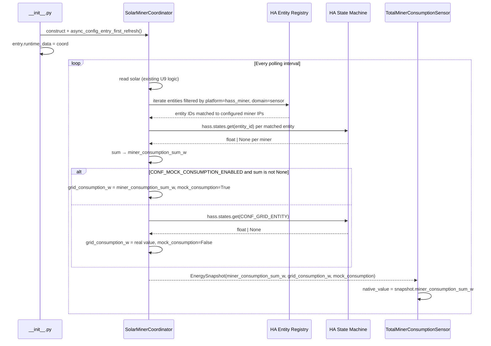

> **Merged into the main integration plan as U10.** Work from [docs/plans/2026-05-15-001-feat-solar-smart-miner-ha-integration-plan.md](docs/plans/2026-05-15-001-feat-solar-smart-miner-ha-integration-plan.md) going forward. This file is retained as an archive.

---

# feat: Mock Consumption Meter — Miner Power Sum Sensor and Mock Grid Consumption Mode

## Summary

Extends the coordinator stub (alongside the existing U9 Mock Solar Mode) to ingest grid consumption — both from the real inverter entity and from a new mock mode that sums hass-miner power draw across all configured miners. A new minimal `sensor.py` exposes that miner consumption sum as a persistent HA sensor entity, giving operators and developers a live read on total miner load independent of whether mock mode is active.

---

## Problem Frame

The Solar Smart Miner coordinator needs two energy readings to make useful decisions: solar production (already mockable via U9) and grid consumption (R2). In production, grid consumption comes from the solar inverter. For development without an inverter, developers currently have no mock source and cannot exercise consumption-dependent code paths — profiles, safety-layer logic, and AI decisions that involve household load — without real hardware. This plan fills that gap.

---

## Requirements

- R2. The integration reads a configurable HA entity for grid consumption (watts) — this plan extends the coordinator stub to read this entity and substitute a computed mock when enabled
- R30. The test suite runs without real hardware — mock consumption mode enables exercising consumption-dependent coordinator paths without a real inverter

**Origin actors:** A2 (AI decision agent — consumes `grid_consumption_w` as a decision input), A4 (hass-miner — source of per-miner power draw for the mock sum)

**Origin flows:** F1 (Normal decision cycle — step 1 reads grid consumption from HA entities)

---

## Scope Boundaries

- Full decision-cycle use of `grid_consumption_w` by the safety layer and AI agent — the snapshot field is populated here; how each component acts on it lands in U3–U5
- Full `sensor.py` entity platform with hashrate, efficiency, and temperature sensors (U7) — this plan creates only `TotalMinerConsumptionSensor`; all other sensor entities land in U7
- Consumption-based profile parameter tuning — the AI uses the snapshot values; profile logic is U5
- hass-miner entity discovery as a general-purpose mechanism — `_sum_miner_power_w()` is purpose-built for power consumption only; the full entity resolution pattern for U3/U6 is developed separately

### Deferred to Follow-Up Work

- Exposing mock consumption state in the HA UI beyond the sensor entity: separate enhancement once U7 lands
- Extending the meter sensor to also show real grid consumption when mock mode is off: can be added in U7 when full sensor.py is in place
- Entry options reload on polling interval change (needed for U3's full coordinator lifecycle): out of scope here; this plan only adds coordinator construction to `__init__.py`

---

## Context & Research

### Relevant Code and Patterns

- `custom_components/solar_smart_miner/coordinator.py` — U9 stub; `_parse_state_float()` helper; mock solar substitution and fallback pattern to mirror directly for consumption
- `custom_components/solar_smart_miner/protocols.py` — `EnergySnapshot` dataclass; add `grid_consumption_w`, `miner_consumption_sum_w`, `mock_consumption` fields here
- `custom_components/solar_smart_miner/const.py` — `CONF_MOCK_SOLAR_*` constants; add parallel `CONF_MOCK_CONSUMPTION_ENABLED` constant
- `custom_components/solar_smart_miner/config_flow.py` — `_options_schema()` and `async_step_init()` in `SolarSmartMinerOptionsFlow`; the mock solar section (including how the entity selector is conditionally excluded) is the direct template
- `custom_components/solar_smart_miner/__init__.py` — `PLATFORMS` already includes `"sensor"`; currently does not create or store the coordinator; must be extended to wire the coordinator to `entry.runtime_data`
- `custom_components/solar_smart_miner/strings.json` / `translations/en.json` — add options label for `mock_consumption_enabled` alongside existing mock solar labels; add entity name for the meter sensor
- `tests/test_coordinator.py` — `_make_entry()` helper pattern; `hass.states.async_set()` for mocking entity state; test structure to follow for new scenarios

### Institutional Learnings

- No `docs/solutions/` yet — first deployment pending

### External References

- [HA DataUpdateCoordinator](https://developers.home-assistant.io/docs/integration_fetching_data/) — coordinator setup and `async_config_entry_first_refresh()` usage
- [HA Entity Registry](https://developers.home-assistant.io/docs/entity_registry_index/) — entity lookup by platform for hass-miner power entities
- [HA CoordinatorEntity](https://developers.home-assistant.io/docs/integration_fetching_data/#coordinated-single-platform) — sensor entity backed by coordinator data

---

## Key Technical Decisions

- **Coordinator always computes the miner sum; mock mode controls whether it substitutes:** `_sum_miner_power_w()` runs every poll cycle regardless of mock mode, and the result is stored in `EnergySnapshot.miner_consumption_sum_w`. This gives the meter sensor a live value even when mock consumption is off. When `CONF_MOCK_CONSUMPTION_ENABLED` is True, the coordinator additionally copies that sum to `grid_consumption_w` and sets `mock_consumption=True`.
- **Meter sensor reads from coordinator data only:** `TotalMinerConsumptionSensor` is a `CoordinatorEntity` that reads `coordinator.data.miner_consumption_sum_w` — no independent hass state reads inside the entity property. All computation stays in the coordinator.
- **hass-miner entity discovery by platform + IP:** Iterate `entity_registry.async_get(hass).entities.values()`, filter on `entry.platform == "hass_miner"` and `entry.domain == "sensor"`, match to configured miner IPs from `entry.data[CONF_MINERS]`. Exact device connection attribute used for IP matching is deferred to implementation (see Open Questions).
- **Partial sum when some miners unavailable:** If one miner's power entity is unavailable, its contribution is skipped and the sum reflects only available miners. Per-miner WARNING is logged. If ALL miners are unavailable, `miner_consumption_sum_w` is `None`.
- **Fallback when mock enabled but sum is None:** If mock mode is enabled but all miners are unavailable, the coordinator falls back to reading the real grid entity — same fallback pattern as U9 mock solar. This is logged as a WARNING.
- **`__init__.py` wires coordinator to `entry.runtime_data`:** Currently, `async_setup_entry` does not create the coordinator. This plan adds that wiring so the sensor platform can access the coordinator via `entry.runtime_data`. This is the correct HA pattern (see U3 plan's `entry.runtime_data` decision); it is added now rather than waiting for U3 to avoid two separate `__init__.py` edits.
- **No user-configurable entity for the mock source:** The mock consumption source is always the computed miner sum, not a user-selected entity. This differs from mock solar (which requires the user to pick a Forecast.Solar entity) because the miner sum is derived from the integration's own configured miners — no external entity picker needed.

---

## Open Questions

### Resolved During Planning

- **Meter sensor value when mock is off:** Always show `miner_consumption_sum_w` (always computed by the coordinator). The sensor is useful for monitoring miner load in production, not just during development.
- **No entity selector for mock consumption:** Unlike mock solar mode, no entity picker is needed because the mock source is the coordinator's own miner sum computation.
- **Coordinator lifecycle:** `__init__.py` must create and store the coordinator, and call `async_config_entry_first_refresh()`, so the sensor platform setup can read coordinator data via `entry.runtime_data`.

### Deferred to Implementation

- **Exact hass-miner device attribute for IP matching:** Which attribute on the device registry entry holds the miner's IP — `configuration_url`, `connections` (set of tuples), or `identifiers`. Verify against a live hass-miner instance.
- **hass-miner power entity selection among multiple sensor entities:** Which sensor entity represents power consumption (watts) when hass-miner registers several sensors per miner. Filter candidates by `device_class == SensorDeviceClass.POWER` and `unit_of_measurement == "W"`, but confirm the exact naming at implementation time.

---

## High-Level Technical Design

> *This illustrates the intended approach and is directional guidance for review, not implementation specification. The implementing agent should treat it as context, not code to reproduce.*

---

## Implementation Units

### U1. Extend EnergySnapshot and constants

**Goal:** Add `grid_consumption_w`, `miner_consumption_sum_w`, and `mock_consumption` fields to `EnergySnapshot`; add the `CONF_MOCK_CONSUMPTION_ENABLED` constant. These changes establish the data contract before coordinator and sensor code is written, and all new fields are optional-with-defaults to preserve backward compatibility.

**Requirements:** R2

**Dependencies:** None

**Files:**
- Modify: `custom_components/solar_smart_miner/protocols.py`
- Modify: `custom_components/solar_smart_miner/const.py`
- Test: `tests/test_protocols.py` (create)

**Approach:**
- `protocols.py`: add `grid_consumption_w: float | None = None`, `miner_consumption_sum_w: float | None = None`, `mock_consumption: bool = False` to `EnergySnapshot`; all new fields use `field(default=...)` or plain defaults so existing instantiations (`EnergySnapshot(solar_production_w=2000.0)`) are not broken
- `const.py`: add `CONF_MOCK_CONSUMPTION_ENABLED = "mock_consumption_enabled"` alongside the existing `CONF_MOCK_SOLAR_*` constants

**Patterns to follow:**
- Existing `EnergySnapshot` dataclass shape in `protocols.py`
- `CONF_MOCK_SOLAR_ENABLED` constant naming convention in `const.py`

**Test scenarios:**
- Happy path: `EnergySnapshot(solar_production_w=2000.0)` constructs without error; `grid_consumption_w`, `miner_consumption_sum_w` are `None`, `mock_consumption` is `False`
- Happy path: `EnergySnapshot(solar_production_w=2000.0, grid_consumption_w=1200.0, miner_consumption_sum_w=800.0, mock_consumption=True)` constructs and all fields are accessible with correct values

**Verification:**
- All existing coordinator tests pass without modification (backward-compatible defaults)
- New fields accessible and correctly typed on `EnergySnapshot` instances

---

### U2. Coordinator extension — grid consumption reading, miner sum, and `__init__.py` wiring

**Goal:** Extend the coordinator to always compute total miner power (`miner_consumption_sum_w`) via entity registry lookup, read real grid consumption, and conditionally substitute the miner sum as the grid consumption value when mock mode is enabled. Wire the coordinator to `entry.runtime_data` in `__init__.py` so subsequent platform setups can access it. Add the mock consumption toggle to OptionsFlow.

**Requirements:** R2, R30

**Dependencies:** U1

**Files:**
- Modify: `custom_components/solar_smart_miner/coordinator.py`
- Modify: `custom_components/solar_smart_miner/__init__.py`
- Modify: `custom_components/solar_smart_miner/config_flow.py`
- Modify: `custom_components/solar_smart_miner/strings.json`
- Modify: `custom_components/solar_smart_miner/translations/en.json`
- Test: `tests/test_coordinator.py` (extend)

**Approach:**
- **`coordinator.py` — `_sum_miner_power_w(hass, entry)`:** iterate `entity_registry.async_get(hass).entities.values()`; filter by `entry_data.platform == "hass_miner"` and `entry_data.domain == "sensor"`; for each configured miner IP in `entry.data[CONF_MINERS]`, match entity to device by IP (see Open Questions on exact attribute); call `_parse_state_float(hass.states.get(entity_id))` for matched entity; accumulate non-None values; log WARNING for each miner whose entity is not found or returns None; return sum or `None` if no values found
- **`coordinator.py` — `_async_update_data()`:** after reading solar, call `_sum_miner_power_w()` and set `miner_consumption_sum_w` on the in-progress snapshot; then read `CONF_MOCK_CONSUMPTION_ENABLED` from `entry.options`; if enabled and sum is not None → set `grid_consumption_w = miner_consumption_sum_w`, `mock_consumption=True`, log `[MOCK CONSUMPTION] Using miner sum: {sum}W`; if enabled but sum is None → fall back to real grid entity, log WARNING; if disabled → read `hass.states.get(entry.data[CONF_GRID_ENTITY])` via `_parse_state_float()` and set `grid_consumption_w`; propagate `None` for `grid_consumption_w` when real entity is unavailable (do not raise — U3 will decide how coordinator handles missing consumption in the decision loop)
- **`__init__.py` — `async_setup_entry()`:** construct `SolarMinerCoordinator(hass, entry)`, call `await coordinator.async_config_entry_first_refresh()`, set `entry.runtime_data = coordinator`, then call `async_forward_entry_setups(entry, PLATFORMS)`; in `async_unload_entry()` no explicit coordinator teardown is needed (DataUpdateCoordinator registers its own listeners via HA lifecycle)
- **`config_flow.py` — `_options_schema()`:** add `vol.Optional(CONF_MOCK_CONSUMPTION_ENABLED, default=options.get(CONF_MOCK_CONSUMPTION_ENABLED, False)): bool`; no entity selector is needed (mock source is the computed miner sum, not a user-chosen entity)
- **`config_flow.py` — `async_step_init()`:** extract `CONF_MOCK_CONSUMPTION_ENABLED` from `user_input` and add to `_pending_options`
- **`strings.json` / `translations/en.json`:** add label for `mock_consumption_enabled` key in the `options.step.init.data` section

**Patterns to follow:**
- `_parse_state_float()` in `coordinator.py`
- Mock solar substitution and fallback logic in `_async_update_data()` (U9 implementation)
- `async_step_init()` extraction and `_pending_options` assignment pattern in `config_flow.py`
- `entry.runtime_data = coordinator` pattern from the main integration plan (Key Technical Decisions section)

**Test scenarios:**
- Happy path: mock consumption disabled, real grid entity has state `"1800"` → `snapshot.grid_consumption_w == 1800.0`, `snapshot.mock_consumption is False`
- Happy path: mock disabled, miners configured → `snapshot.miner_consumption_sum_w` is populated (coordinator always computes it regardless of mock mode)
- Happy path: mock consumption enabled, two hass-miner entities report `600` and `400` → `snapshot.miner_consumption_sum_w == 1000.0`, `snapshot.grid_consumption_w == 1000.0`, `snapshot.mock_consumption is True`
- Edge case: one miner entity unavailable (state `"unavailable"`), one returns `500` → `snapshot.miner_consumption_sum_w == 500.0`; WARNING logged; sum still returned
- Edge case: all miner entities unavailable, mock enabled → coordinator falls back to real grid entity, `snapshot.mock_consumption is False`, WARNING logged
- Edge case: no miners configured in `CONF_MINERS`, mock enabled → `miner_consumption_sum_w is None`, falls back to real grid entity
- Edge case: mock disabled, real grid entity state is `"unavailable"` → `snapshot.grid_consumption_w is None`; no exception raised
- Integration: `__init__.py` `async_setup_entry` creates coordinator, calls `async_config_entry_first_refresh()`, stores on `entry.runtime_data`; subsequent platform setups can access coordinator via `entry.runtime_data`

**Verification:**
- All existing coordinator tests pass
- New test cases pass for mock enabled/disabled and fallback scenarios
- `entry.runtime_data` is set after `async_setup_entry` completes

---

### U3. Total Miner Consumption meter sensor entity

**Goal:** Expose `EnergySnapshot.miner_consumption_sum_w` as a persistent HA sensor (`sensor.solar_smart_miner_total_miner_consumption`) that is always registered and always shows the current computed miner load — regardless of whether mock consumption mode is active.

**Requirements:** R30 (hardware-free dev visibility)

**Dependencies:** U1, U2

**Files:**
- Create: `custom_components/solar_smart_miner/sensor.py`
- Modify: `custom_components/solar_smart_miner/strings.json`
- Modify: `custom_components/solar_smart_miner/translations/en.json`
- Test: `tests/test_sensor.py` (create)

**Approach:**
- `sensor.py`: `async_setup_entry(hass, entry, async_add_entities)` retrieves coordinator from `entry.runtime_data` and calls `async_add_entities([TotalMinerConsumptionSensor(coordinator, entry)])`
- `TotalMinerConsumptionSensor(CoordinatorEntity[SolarMinerCoordinator], SensorEntity)`: `native_value` returns `self.coordinator.data.miner_consumption_sum_w` when `self.coordinator.data` is not None, else `None`; `native_unit_of_measurement = UnitOfPower.WATT`, `device_class = SensorDeviceClass.POWER`, `state_class = SensorStateClass.MEASUREMENT`; `_attr_has_entity_name = True`; `_attr_name = "Total Miner Consumption"`
- Entity unique_id: `f"{entry.unique_id}_total_miner_consumption"`
- Device info: a single virtual device per config entry representing the integration hub (no physical device association needed for this development sensor)
- `strings.json` / `translations/en.json`: add sensor entity entry for `total_miner_consumption` under the entity translation section

**Execution note:** This is a minimal stub — `sensor.py` will be substantially expanded in U7 with per-miner sensors and system sensors. Keep this file as thin as possible: one `async_setup_entry`, one sensor class. Avoid patterns that lock in assumptions U7 will need to revisit.

**Patterns to follow:**
- `CoordinatorEntity[SolarMinerCoordinator]` base class; `coordinator.data` access pattern
- `SensorDeviceClass.POWER` + `SensorStateClass.MEASUREMENT` for power sensors
- `UnitOfPower.WATT` from `homeassistant.const`
- `_attr_has_entity_name = True` convention for modern HA entity naming

**Test scenarios:**
- Happy path: coordinator data has `miner_consumption_sum_w = 1400.0` → sensor `native_value` returns `1400.0`
- Happy path: coordinator data has `miner_consumption_sum_w = None` (no miners configured or all unavailable) → `native_value` returns `None`; entity state shows `unavailable`
- Edge case: `coordinator.data` is `None` (first refresh pending or failed) → `native_value` returns `None` without `AttributeError`
- Integration: after coordinator delivers a new `EnergySnapshot` with `miner_consumption_sum_w = 900.0`, sensor state updates to `900.0` on the next HA entity state write (via `CoordinatorEntity`'s `_handle_coordinator_update` mechanism)

**Verification:**
- `sensor.solar_smart_miner_total_miner_consumption` appears in the HA UI after config entry setup
- Sensor value matches `miner_consumption_sum_w` in coordinator data
- Sensor shows `unavailable` when no miners are reporting

---

## System-Wide Impact

- **Interaction graph:** `_sum_miner_power_w()` reads the HA entity registry on every coordinator poll. This is a registry read (in-memory), not a network call — expected to be fast. The registry is read-only here; no writes.
- **Error propagation:** `_sum_miner_power_w()` returns `None` on total failure and logs per-miner warnings — it does not raise. `grid_consumption_w = None` propagates safely through the snapshot; downstream consumers (safety layer, AI agent in U3–U5) will need to handle `None` consumption gracefully — that handling is not added here.
- **State lifecycle risks:** On HA restart, `miner_consumption_sum_w` and `grid_consumption_w` are both `None` until the first coordinator update completes (`async_config_entry_first_refresh` blocks platform setup until this succeeds or raises). The sensor shows `unavailable` until the coordinator has run at least once, which is the correct behavior.
- **`__init__.py` change blast radius:** Adding coordinator construction to `async_setup_entry` is a load-bearing change — any test that exercises the full HA setup lifecycle will now trigger `async_config_entry_first_refresh()`. Tests that use `MockConfigEntry` and call `async_setup_entry` directly should patch `SolarMinerCoordinator.async_config_entry_first_refresh` to avoid real coordinator data fetches.
- **Unchanged invariants:** U9 mock solar logic in `coordinator.py` is not modified; only new fields are added to the return value. The `PLATFORMS` list in `__init__.py` already declares `"sensor"` — creating `sensor.py` activates the platform that was already declared; no `__init__.py` PLATFORMS change is needed.

---

## Risks & Dependencies

| Risk | Mitigation |
|------|------------|
| hass-miner entity discovery by IP finds zero or multiple entities per miner | Implementation-time verification against a live hass-miner instance; defer exact matching attribute to Open Questions; `_sum_miner_power_w()` gracefully returns partial sum or None on discovery failure |
| `async_config_entry_first_refresh()` in `__init__.py` causes existing integration tests to fail (they currently skip coordinator setup) | Patch `SolarMinerCoordinator.async_config_entry_first_refresh` in test fixtures; this is standard HA test practice and does not change test semantics |
| `sensor.py` creation causes import errors in existing tests if any test imports `solar_smart_miner` as a module | Verify existing tests do not import sensor.py implicitly; add a `hass.config_entries.async_setup(entry_id)` patch in tests that don't need platform setup |

---

## Sources & References

- **Origin document:** [docs/brainstorms/solar-smart-miner-requirements.md](docs/brainstorms/solar-smart-miner-requirements.md)
- **Existing integration plan:** [docs/plans/2026-05-15-001-feat-solar-smart-miner-ha-integration-plan.md](docs/plans/2026-05-15-001-feat-solar-smart-miner-ha-integration-plan.md) (U9 mock solar pattern, U3 coordinator design, U6 entity registry lookup approach)
- **U9 implementation:** `custom_components/solar_smart_miner/coordinator.py`
- [HA DataUpdateCoordinator docs](https://developers.home-assistant.io/docs/integration_fetching_data/)
- [HA Entity Registry docs](https://developers.home-assistant.io/docs/entity_registry_index/)
- [HA CoordinatorEntity docs](https://developers.home-assistant.io/docs/integration_fetching_data/#coordinated-single-platform)
