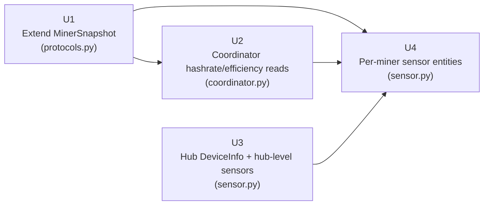

# feat: Hub device registration and sensor entity exposure

## Summary

Register a hub `DeviceInfo` on the config entry, expose all U11 coordinator data as HA sensor entities, and extend `MinerSnapshot` + coordinator reads with hashrate and efficiency (completing R4 from the origin requirements). After this plan, the operator can add an HA Entities card filtered to the hub device and see solar/energy state and per-miner readings in one place.

---

## Problem Frame

U11 delivers a coordinator that reads solar production, grid consumption, battery SOC, and full per-miner state every poll cycle. Only one entity (`TotalMinerConsumptionSensor`) exposes any of that data, and no HA device is registered, so the integration cannot be added to a dashboard. This plan surfaces all coordinator data as real HA sensor entities under a single hub device.

---

## Requirements

Carried from [origin document](docs/brainstorms/2026-05-18-dashboard-card-entities-requirements.md):

- **R1** — Hub `DeviceInfo` registered; all entities attach to it
- **R2** — Solar production sensor (W)
- **R3** — Grid consumption sensor (W, optional — only when configured)
- **R4** — Battery SOC sensor (%, optional — only when configured)
- **R5** — `TotalMinerConsumptionSensor` updated to attach to hub DeviceInfo
- **R6–R10** — Per-miner sensors: power draw, temperature, power limit, hashrate, efficiency
- **R11** — `MinerSnapshot` gains `hashrate_th` and `efficiency_jth` fields
- **R12** — Coordinator discovers and reads hashrate/efficiency from hass-miner entities
- **R13** — All entities use `CoordinatorEntity`; update on every coordinator poll
- **R14** — Miner add/remove takes effect after config entry reload

Origin requirements doc carries acceptance examples AE1–AE4 as the primary verification targets.

---

## Scope Boundaries

### In scope

- Hub `DeviceInfo` on `entry.entry_id`
- Hub-level sensors: solar production, grid consumption (optional), battery SOC (optional), total miner consumption (update only)
- Per-miner sensors: power draw, temperature, power limit, hashrate, efficiency — all under the hub device
- `MinerSnapshot` + coordinator extension for hashrate and efficiency (completes R4 from solar-smart-miner-requirements.md)

### Deferred to follow-up work (U7 remainder)

- Profile selector entity (`select` platform)
- Dry-run switch entity (`switch` platform)
- Last-decision text sensor
- Coordinator status sensor (running / safety override / fault)

### Outside this product's identity

*(Carried verbatim from origin — not applicable to this plan unit)*

---

## High-Level Technical Design

*This illustrates the intended approach and is directional guidance for review, not implementation specification. The implementing agent should treat it as context, not code to reproduce.*

**Implementation unit dependency graph:**



U3 is independent of U1/U2 and may be implemented in parallel. U4 depends on all three preceding units.

**Entity layout under hub device:**

```
Hub device  identifiers={(DOMAIN, entry.entry_id)}
├── Solar production           (SolarProductionSensor)
├── Grid consumption           (GridConsumptionSensor, optional)
├── Battery SOC                (BatterySocSensor, optional)
├── Total miner consumption    (TotalMinerConsumptionSensor, updated)
├── {Miner A name} power draw  (MinerSensor × power_w)
├── {Miner A name} temperature (MinerSensor × temperature_c)
├── {Miner A name} power limit (MinerSensor × power_limit_w)
├── {Miner A name} hashrate    (MinerSensor × hashrate_th)
├── {Miner A name} efficiency  (MinerSensor × efficiency_jth)
└── ... (same 5 entries per additional miner)
```

All entities share the same `DeviceInfo(identifiers={(DOMAIN, entry.entry_id)})` — no `via_device` sub-devices. This is the topology required for a single HA Entities card to show all readings together. (See origin: docs/brainstorms/2026-05-18-dashboard-card-entities-requirements.md — "All entities live under the hub device.")

---

## Key Technical Decisions

- **Same `DeviceInfo` for per-miner and hub-level entities:** The standard HA hub pattern uses `via_device` to create per-miner sub-devices, but that splits readings across multiple device cards. Because the brainstorm explicitly chose a single hub card with per-miner rows, all entities share `DeviceInfo(identifiers={(DOMAIN, entry.entry_id)})`. (see origin: docs/brainstorms/2026-05-18-dashboard-card-entities-requirements.md — Key Decisions)

- **`entry.entry_id` as hub identifier:** `entry.unique_id` may be `None` on existing config entries (current test `test_sensor_unique_id_uses_entry_id_fallback` already covers this); `entry.entry_id` is always stable.

- **Hashrate/efficiency discovered by `original_unit_of_measurement`, not `device_class`:** hass-miner sets `device_class=None` for hashrate and efficiency sensors (only `native_unit_of_measurement` is set to `"TH/s"` / `"J/TH"`). The coordinator's existing approach of filtering by `original_device_class` cannot be used here. Filter by `e.original_unit_of_measurement` on the entity registry entry — `unit_of_measurement` is the user-override field and is `None` unless the user has customised it. This mirrors the existing `original_device_class` convention used for power and temperature entities. (Confirmed from `config/custom_components/miner/sensor.py`.)

- **Single parametric `MinerSensor` class:** Rather than five subclasses, one `MinerSensor` class accepts a metric key and a `SensorEntityDescription`-equivalent set of parameters. This keeps `sensor.py` manageable as the miner count grows.

- **Optional sensors created at setup time:** Grid and battery sensors are conditionally instantiated in `async_setup_entry` (guard: `entry.data.get(CONF_GRID_ENTITY, "")` truthy). Per-miner sensors are created for all miners in `CONF_MINERS` at setup; new miners require a config entry reload (standard HA pattern — R14).

---

## Implementation Units

### U1. Extend `MinerSnapshot` with hashrate and efficiency fields

**Goal:** Add `hashrate_th: float | None = None` and `efficiency_jth: float | None = None` to `MinerSnapshot`, establishing the data model fields before coordinator and entity work depends on them.

**Requirements:** R11

**Dependencies:** None

**Files:**
- Modify: `custom_components/solar_smart_miner/protocols.py`
- Modify: `tests/test_protocols.py`

**Approach:** Append both fields after `power_limit_entity_id` as positional fields with `None` defaults. Because they come last and have defaults, all existing tests that construct `MinerSnapshot` without these fields continue to work without modification.

**Patterns to follow:** Existing `EnergySnapshot` optional-field pattern (`grid_consumption_w: float | None = None`, `battery_soc_pct: float | None = None`).

**Test scenarios:**
- `MinerSnapshot(miner_id="x", ip="1.2.3.4", power_w=None, power_limit_w=None, min_power_w=None, max_power_w=None, temperature_c=None, is_available=True, power_limit_entity_id=None)` constructs without error; `hashrate_th is None`, `efficiency_jth is None`
- `MinerSnapshot(..., hashrate_th=45.5, efficiency_jth=21.3)` constructs and retains both values
- Existing `test_protocols.py` tests still pass (backward compat verification)

**Verification:** `pytest tests/test_protocols.py` passes; `MinerSnapshot` importable with new fields.

---

### U2. Extend coordinator to discover and read hashrate and efficiency

**Goal:** Populate `MinerSnapshot.hashrate_th` and `efficiency_jth` by discovering the corresponding hass-miner entities from the HA entity registry and reading their state on every poll cycle.

**Requirements:** R12, R4 (solar-smart-miner-requirements.md — completing full per-miner sensor reads)

**Dependencies:** U1

**Files:**
- Modify: `custom_components/solar_smart_miner/coordinator.py`
- Modify: `tests/test_coordinator.py`

**Approach:**

In `_async_read_miners`, after the existing power/temperature/power-limit entity lookups, add two more lookups in the same `device_entities` list filtered to `e.domain == "sensor"`:

```
hashrate_entry  → original_unit_of_measurement == "TH/s"
efficiency_entry → original_unit_of_measurement == "J/TH"
```

*(Directional guidance — not implementation specification.)*

Use `e.original_unit_of_measurement` (not `e.unit_of_measurement` which is the user-override field and is `None` by default). This mirrors the existing use of `e.original_device_class` for power and temperature discovery.

Read state via `_parse_state_float`; pass values to `MinerSnapshot`. When either entity is not found or unavailable, the field defaults to `None` — no warning is emitted (these are diagnostic sensors that may be absent on some miners).

Update the INFO snapshot log format to include hashrate and efficiency values (render as `n/a` when `None`).

**Patterns to follow:** Existing `power_entry` / `temp_entry` / `limit_entry` discovery pattern in `_async_read_miners`; `_parse_state_float` for safe state reads; when creating test entity registry entries, pass `original_unit_of_measurement="TH/s"` or `"J/TH"` to `er.async_get_or_create` (matches how `original_device_class="power"` is passed for the existing power sensor tests).

**Test scenarios:**
- Happy path: miner device has TH/s entity registered via `er.async_get_or_create(..., original_unit_of_measurement="TH/s")` with state set to `"45.5"` → `snapshot.miners[0].hashrate_th == 45.5`; same for J/TH → `efficiency_jth == 21.3`
- Edge case: hass-miner device found but no `TH/s` entity in registry → `hashrate_th is None`, no exception, no warning
- Edge case: `TH/s` entity registered but state is `"unavailable"` → `hashrate_th is None`, no exception
- Backward compat: all existing miner happy-path tests still pass; `hashrate_th` and `efficiency_jth` absent from existing test snapshots default to `None`
- Log format: INFO snapshot line includes hashrate/efficiency fields (assert `_LOGGER.info` called once with updated format string)

**Verification:** `pytest tests/test_coordinator.py` passes; INFO log snapshot line shows hashrate and efficiency.

---

### U3. Register hub DeviceInfo and expose hub-level sensors

**Goal:** Attach a hub `DeviceInfo` to the existing `TotalMinerConsumptionSensor` and add `SolarProductionSensor`, `GridConsumptionSensor` (optional), and `BatterySocSensor` (optional) to the entity platform.

**Requirements:** R1, R2, R3, R4 (brainstorm doc), R5

**Dependencies:** None (independent of U1/U2)

**Files:**
- Modify: `custom_components/solar_smart_miner/sensor.py`
- Modify: `tests/test_sensor.py`

**Approach:**

Add `from homeassistant.helpers.device_registry import DeviceInfo` import.

Extract a module-level helper `_hub_device_info(entry: ConfigEntry) -> DeviceInfo` that returns `DeviceInfo(identifiers={(DOMAIN, entry.entry_id)}, name=entry.title)`. All hub-level sensors (and per-miner sensors in U4) call this helper — the hub identifier is consistent everywhere.

In `TotalMinerConsumptionSensor.__init__`, add `self._attr_device_info = _hub_device_info(entry)`.

New sensor classes (each `CoordinatorEntity[SolarMinerCoordinator]` + `SensorEntity`):

- `SolarProductionSensor` — device_class `POWER`, unit `W`, state_class `MEASUREMENT`; reads `coordinator.data.energy.solar_production_w`; `None` when `solar_fault=True` or data is `None`
- `GridConsumptionSensor` — same device/unit/state; reads `grid_consumption_w`
- `BatterySocSensor` — device_class `BATTERY`, unit `%`, state_class `MEASUREMENT`; reads `battery_soc_pct`

Unique ID suffixes: `_solar_production`, `_grid_consumption`, `_battery_soc` on `{entry.unique_id or entry.entry_id}` prefix.

In `async_setup_entry`: always add `SolarProductionSensor`; guard `GridConsumptionSensor` on `entry.data.get(CONF_GRID_ENTITY, "")` truthy; guard `BatterySocSensor` on `entry.data.get(CONF_BATTERY_ENTITY, "")` truthy.

**Patterns to follow:** `TotalMinerConsumptionSensor` for class structure and `_attr_has_entity_name = True` naming; existing `async_setup_entry` pattern in `sensor.py`; `_make_coordinator_with_data` + direct sensor construction in `test_sensor.py`.

**Test scenarios:**
- Solar production: `native_value == 2450.0` when `coordinator.data.energy.solar_production_w == 2450.0`
- Solar production: `native_value is None` when `coordinator.data is None`
- Solar production: `native_value is None` when `solar_fault=True` (solar_production_w is None)
- Grid consumption: entity created when `CONF_GRID_ENTITY` is a non-empty string in `entry.data`
- Grid consumption: entity NOT created when `CONF_GRID_ENTITY` is absent or empty
- Grid consumption: `native_value == 1200.0` when `grid_consumption_w == 1200.0`
- Battery SOC: entity created when `CONF_BATTERY_ENTITY` non-empty; NOT created when absent/empty
- Battery SOC: `native_value == 78.0` when `battery_soc_pct == 78.0`
- Hub DeviceInfo: `solar_sensor.device_info.identifiers == {(DOMAIN, entry.entry_id)}`
- Hub DeviceInfo: same identifiers set on `TotalMinerConsumptionSensor` (regression — no orphan entity)
- Unique IDs: solar, grid, battery sensors carry the expected suffix on `entry.entry_id` prefix
- Covers AE3: when `CONF_BATTERY_ENTITY` absent from entry data, `BatterySocSensor` is not instantiated and no error is raised

**Verification:** `pytest tests/test_sensor.py` passes; after `async_setup_entry`, HA device registry contains a device matching `(DOMAIN, entry.entry_id)`.

---

### U4. Expose per-miner sensor entities

**Goal:** Create power draw, temperature, power limit, hashrate, and efficiency sensor entities for each configured miner, all attached to the hub device.

**Requirements:** R6, R7, R8, R9, R10, R13, R14

**Dependencies:** U1, U2, U3

**Files:**
- Modify: `custom_components/solar_smart_miner/sensor.py`
- Modify: `tests/test_sensor.py`

**Approach:**

Add a single `MinerSensor(CoordinatorEntity[SolarMinerCoordinator], SensorEntity)` class. Its `__init__` accepts `coordinator`, `entry`, `miner_ip`, `miner_name`, and `metric` (an enum or string key). All metric-specific attributes (`device_class`, `native_unit_of_measurement`, `state_class`) are determined from the metric key at init time.

| Metric key | device_class | unit | state_class |
|---|---|---|---|
| `power_w` | `POWER` | `W` | `MEASUREMENT` |
| `temperature_c` | `TEMPERATURE` | `°C` | `MEASUREMENT` |
| `power_limit_w` | `POWER` | `W` | `MEASUREMENT` |
| `hashrate_th` | None | `"TH/s"` | `MEASUREMENT` |
| `efficiency_jth` | None | `"J/TH"` | `MEASUREMENT` |

`native_value`:
1. Guard `coordinator.data is None` → return `None`
2. Find `MinerSnapshot` where `miner.ip == self._miner_ip` in `coordinator.data.miners`
3. Return `None` when miner not found or `is_available=False`
4. Return `getattr(miner, self._metric_key)` — which is also `None` when the sensor is unavailable

> **Note on `is_available` coupling:** Step 3 suppresses hashrate and efficiency even when those entities may still be healthy — `is_available=False` is set when the power entity is missing, not when hashrate/efficiency are. This is an accepted simplification for v1: all per-miner sensors reflect the overall miner availability. If independent per-sensor availability is needed later, step 3 can be removed for diagnostic metrics only.

Unique ID pattern: `{entry.unique_id or entry.entry_id}_{miner_ip.replace(".", "_")}_{metric_key}`

Entity name (`_attr_name` with `_attr_has_entity_name = True`): `"{miner_name} {metric_label}"` (e.g., `"ASIC 1 power draw"`)

`_attr_device_info = _hub_device_info(entry)` — same hub device as all other entities.

In `async_setup_entry`: iterate `entry.data.get(CONF_MINERS, [])`, create all 5 `MinerSensor` instances per miner, append to the entities list.

**Patterns to follow:** `TotalMinerConsumptionSensor` class structure; `_hub_device_info` helper from U3; `_make_coordinator_with_data` + direct sensor construction in `test_sensor.py`.

**Test scenarios:**
- Happy path: 2 miners configured → 10 per-miner entities created; `MinerSensor` for miner at `192.168.1.10` with metric `power_w` returns `600.0` when `MinerSnapshot.power_w == 600.0`
- Zero miners configured (`CONF_MINERS=[]`): no per-miner entities created; hub-level sensors unaffected
- `coordinator.data is None`: all per-miner sensor `native_value` returns `None`, no exception
- Miner `is_available=False`: all 5 sensors for that miner return `None`; other miners' sensors return correct values
- Hashrate: `native_value == 45.5` when `MinerSnapshot.hashrate_th == 45.5`
- Hashrate: `native_value is None` when `hashrate_th is None`
- Efficiency: `native_value == 21.3` when `efficiency_jth == 21.3`
- Power limit: `native_value == 750.0` when `MinerSnapshot.power_limit_w == 750.0`
- DeviceInfo: `miner_sensor.device_info.identifiers == {(DOMAIN, entry.entry_id)}` (hub device, not sub-device)
- Unique ID: follows `{entry.entry_id}_{miner_ip_underscored}_{metric_key}` pattern; unique across all sensors in a 2-miner config
- Covers AE1: after setup with 2 configured miners where the entry fixture includes non-empty `CONF_GRID_ENTITY` and `CONF_BATTERY_ENTITY`, device has 4 hub-level (solar + grid + battery + total consumption) + 10 per-miner = 14 entities; without the optional entities configured the count is 12
- Covers AE2: when all MinerSnapshot entries have `is_available=False`, all 10 per-miner sensors return `None`

**Verification:** `pytest tests/test_sensor.py` passes; with 2 configured miners, `hass.states.async_all()` after integration setup includes all 14 expected entity states; an HA Entities card filtered to the hub device shows all readings.

---

## System-Wide Impact

- **`protocols.py`:** `MinerSnapshot` gains two backward-compatible optional fields; no existing consumer breaks.
- **`coordinator.py`:** `_async_read_miners` extended; `CoordinatorSnapshot` data type unchanged; INFO log format gains hashrate/efficiency fields.
- **`sensor.py`:** Significant growth — hub device info, 3 new hub-level sensor classes, 1 parametric per-miner sensor class, updated `async_setup_entry`. No changes to `__init__.py`, `config_flow.py`, or `const.py`.
- **Entity blast radius on config entry reload:** All entities are recreated on reload; HA preserves existing entity states and history by unique ID.

---

## Sources & References

- **Origin document:** [docs/brainstorms/2026-05-18-dashboard-card-entities-requirements.md](docs/brainstorms/2026-05-18-dashboard-card-entities-requirements.md)
- **Parent plan:** [docs/plans/2026-05-15-001-feat-solar-smart-miner-ha-integration-plan.md](docs/plans/2026-05-15-001-feat-solar-smart-miner-ha-integration-plan.md) — this work delivers part of U7
- **U11 plan:** [docs/plans/2026-05-18-001-feat-coordinator-sensor-reads-logging-plan.md](docs/plans/2026-05-18-001-feat-coordinator-sensor-reads-logging-plan.md) — data model this plan builds on
- **hass-miner sensor units:** `config/custom_components/miner/sensor.py` — `"TH/s"` / `"J/TH"` confirmed
- **DeviceInfo + CoordinatorEntity pattern:** `.venv/lib/python3.12/site-packages/homeassistant/components/powerwall/entity.py`
