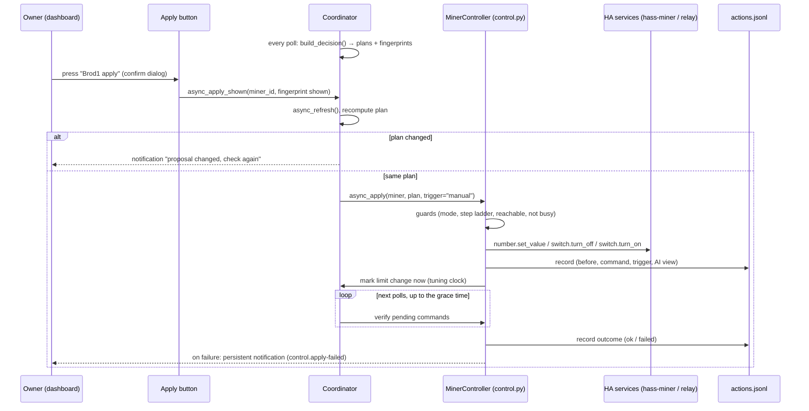
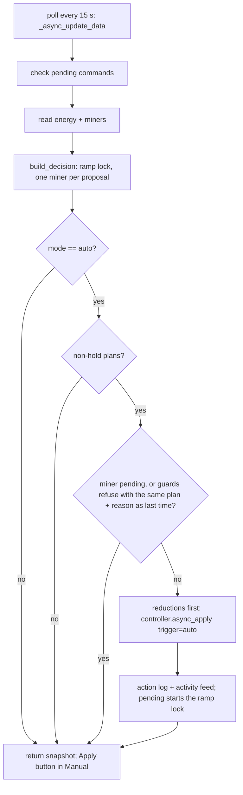

# feat: Semi-automatic apply: confirm each proposed action with a button

## Summary

The rules already work out a concrete plan for every miner on every cycle (set a power step,
stop, start or hold), but nothing carries it out. This plan adds the path that does: an
**Apply** button next to each proposed action, plus an **Apply all** button. Pressing one runs
the plan that is on screen, through one command path that checks it, sends the HA service
calls, verifies the result and logs it.

The owner stays in the loop for every change, so nothing unexpected happens while we learn
whether the plans can be trusted. The command path is built to be shared: **automatic mode
later is a toggle that calls the same function at the end of each cycle**, plus a few guards
that only automation needs (Phase 2, at the end). The buttons themselves don't change.

**Update 2026-10-07:** testing on the farm showed the proposals can run on their own, so Phase 2 is now
planned in detail below: an **Automatic** mode that applies the proposal every cycle, and **Preview is
removed** (Manual already means "nothing is applied unless I press"). The modes become Manual (default) and
Automatic. The owner decided that the A2 guards are not prerequisites; the 4-minute ramp lock is the cooldown.

---

## Progress

Check off each unit after it is implemented, tested and committed.

**Phase 1: semi-automatic (this plan)**

- [x] **S1**: Control mode setting: `Preview` / `Manual` (replaces the unused `dry_run` option)
- [x] **S2**: Command executor (`control.py`): plan → HA service calls, with guards
- [x] **S3**: What you saw is what runs: plan fingerprint, refresh and compare on press
- [x] **S4**: Verify every command and finish a start (pending limit after power-on)
- [x] **S5**: Action log (`actions.jsonl`): who applied what, before, after, result
- [x] **S6**: Entities: per-miner "Proposed action" sensor and "Apply" button, hub "Apply all" button
- [x] **S7**: Dashboard card: a "Proposed actions" section with confirm dialogs
- [x] **S8**: Docs, knowledge base, wording ("preview only" is no longer always true)
- [ ] **S9**: First run on the real miners (manual checklist, below)

**Phase 1 follow-ups (from the 2026-10-06 review; do before or alongside S9)**

- [ ] **S10**: Schedule automation setting and the Manual-mode warning (Decision 4)
- [ ] **S11**: Verify against the miner, not hass-miner's own echo; hold the lock through the limit-change restart
- [ ] **S12**: Any exception from a service call is a `failed` command
- [ ] **S13**: Plan-age guard: refuse a press when the plan changed just before it
- [ ] **S14**: Evidence logging: unpressed proposals, a 60-minute outcome line, engine version

**Phase 2: automatic (planned 2026-10-07, below)**

- [ ] **A3**: Modes: Preview removed, Automatic offered, Manual the default; stored `preview` reads as Manual
- [ ] **A1**: Automatic: the executor accepts trigger `auto`, and the coordinator applies the proposal each cycle
- [ ] **A4**: Entities, card and wording follow the two modes
- [ ] **A5**: README and knowledge base
- [ ] **A2**: Automation-only guards: **deferred** (owner, 2026-10-07). The ramp lock and one-miner-per-proposal part is done (commit 3ca794c).

**Phase 3: AI authority (later, separate plan)**

- [ ] **AI1**: The AI chooses allocation inside the rules' envelope (requirements §7 roadmap stage 2), gated on its own evidence

---

## Where the product is today

| Area | State | What it means for this plan |
|---|---|---|
| Rule decision (`decision.py`) | Done, runs every poll. Produces a `MinerPlan` per miner: `set_limit` / `start` / `stop` / `hold`, with `limit_w`, `method` (relay or pause) and `target_entity_id`. | **The plan is already a command.** Nothing new to decide; we only carry it out. |
| Power steps, tuning, temperature, stop-below-lowest-step | Done in the rules. | Plans only use the miner's steps, stay inside its range, and never step up a tuning miner. One plan can move several steps at once (`_allocate` moves as far as the budget allows); a per-change step cap, if wanted, belongs in A2. |
| Entities to act on | Known per miner in `MinerSnapshot`: `power_limit_entity_id` (hass-miner `number`), `switch_entity_id` (hass-miner `active` = pause/resume), `relay_entity_id` (optional, from Configure). | The executor needs no new discovery. |
| `_async_apply_power_limit` in the coordinator | Exists from U11, tested, **never called**. Clamps to min/max and calls `number.set_value`. | Moves into the executor and gains the step check. |
| `CONF_DRY_RUN` option | In Configure, saved, **read by nothing**. | Replaced by the control mode (S1). |
| AI advice | Advisory only. Its actions are `increase/reduce/hold/stop/start` **without a wattage**. | **Not applied.** Only the rule plan is applied; the AI answer is shown next to it and logged for comparison (P1 `rule.ai-is-advisor`, `rule.apply-by-hand-first`). `rule.guard-above-ai` is about the later stage when AI proposals can be applied. |
| Decision log sensor and card | Shows trace and plans; titled "preview, not applied". | Gets an apply section (S6, S7); the title changes with the mode. |
| Tuning tracking | `_limit_seen` notices a limit change on the next poll. | The executor marks the change at once, so the next cycle already counts the miner as tuning. |
| Schedule automation | Still pauses/resumes at 07:00 and 19:00 (`site.schedule-automation`). | Manual mode warns, it doesn't refuse (see Decisions). Auto mode will refuse. |
| Alerts `control.apply-failed`, `control.schedule-conflict` | Defined in `knowledge/alerts.yaml`, "only exist once decisions are applied". | S4 raises `apply-failed`; Phase 2 enforces `schedule-conflict`. |
| Parent plan U6 (miner control) | Unchecked. Designed around `SafetyDecision`/`AiDecision` and a dry-run bypass that no longer match the code. | **This plan replaces U6.** |

---

## Decisions (proposed, confirm or veto)

1. **Only the rule plan is applied, in this phase.** The rules are the controller (requirements doc §0 point 1, `rule.ai-is-advisor`). Giving the AI authority is a later, separately gated stage (Phase 3), not something this plan rules out; what the AI's answer must contain for that is an open question (see the end). The AI's view of the same miner is shown next to the button and recorded in the action log, so later we can see how often the owner applied a plan the AI disagreed with.
2. **The button applies the plan that is current at the press, and nothing newer.** On press, the coordinator refreshes; if the plan for that miner changed, nothing runs and a notification says "the proposal changed, check again" (S3). No silent substitution. The fingerprint is read from the coordinator at press time, so a plan that changed while the owner was reading the row or the confirm dialog was open is not caught by this check alone (the card's confirm text is static); S13 closes most of that gap by refusing a plan that changed just before the press.
3. **One command path for all triggers.** `async_apply(miner_id, plan, trigger)` with `trigger` = `manual` now, `auto` later. Everything (guards, service calls, verification, logging) lives behind it. Phase 2 adds guards there, not in the buttons.
4. **In Manual mode the schedule automation is a warning, not a block.** The owner is at the screen and is the one controller; refusing would make the button useless until the schedule is retired. Auto mode refuses (P0 `rule.one-controller`, now scoped to automatic control with this Manual exception recorded). The warning needs a setting that names the automation; S10 adds it. Until S10 lands there is no warning.
5. **Apply all runs reductions first**: stops and step-downs, then step-ups and starts, so the house never briefly draws both.
6. **Hold plans have no button.** The Apply button is unavailable (greyed out) when the plan is `hold`, when the mode is Preview, or while a command for that miner is still being verified. *(Phase 2: Preview is removed; the button is unavailable in Automatic instead.)*
7. **Safety plans are not special-cased in Phase 1.** A battery-floor stop is a plan like any other and waits for the button. Running safety plans without a press belongs to Phase 2.

---

## Scope

### In scope

- Control mode `Preview` / `Manual` (select entity and Configure).
- Executor for `set_limit`, `stop`, `start` (relay and pause methods).
- Per-miner Apply buttons and Apply all, with HA confirm dialogs on the generated card.
- Verification of every command, a pending limit after a start, the `control.apply-failed` notification.
- Action log on disk, with the last entries on a sensor attribute for the card.

### Not in scope

- Automatic applying (Phase 2).
- Applying AI answers.
- Hold-time and change-rate limits (the owner is the rate limit in Phase 1).
- Turning the schedule automation off from the integration.
- The `decision/` package split (requirements doc §11). The executor depends only on `MinerPlan`, so the split can happen independently.

---

## High-level design

*Directional; the implementer should follow the code style around it rather than copy this.*

**Plan → service call:**

| Plan | Method | Service call | Done when |
|---|---|---|---|
| `set_limit` | | `number.set_value` on `power_limit_entity_id`, value = `limit_w` | the number entity reads `limit_w` |
| `stop` | `relay` | `switch.turn_off` on the relay | relay reads `off` |
| `stop` | `pause` | `switch.turn_off` on the hass-miner `active` switch | switch reads `off` |
| `start` | `relay` / `pause` | `switch.turn_on` on the same entity, then a **pending limit** | switch `on`, then the number reads `limit_w` (S4) |
| `hold` | | nothing | n/a |

---

## Implementation units

### S1. Control mode

**Goal:** One setting that says whether the integration may touch the miners.

- `const.py`: `CONF_CONTROL_MODE`, `CONTROL_MODE_PREVIEW = "preview"`, `CONTROL_MODE_MANUAL = "manual"` (and the reserved `CONTROL_MODE_AUTO = "auto"`, not offered yet). Default `preview`, so an upgrade changes nothing until the owner chooses.
- `select.py`: `ControlModeSelect` next to `ProfileSelect`, same pattern (writes the option; the entry reloads).
- `config_flow.py`: replace the `CONF_DRY_RUN` checkbox with the control mode in the settings step. Saved `dry_run` values are ignored (it was never read), so no migration is needed. Remove the key from the schema.
- Coordinator exposes `control_mode` as a property for the entities.

**Tests:** select shows and writes the mode; the options flow saves it; the default is `preview`; the old `dry_run` option is no longer offered (update `test_options_flow_sets_dry_run` into a control-mode test rather than deleting it).

### S2. Command executor (`control.py`)

**Goal:** The single place that turns a `MinerPlan` into service calls. Both triggers use it.

- New `control.py` with `MinerController(hass)` and `async_apply(miner: MinerSnapshot, plan: MinerPlan, *, trigger: str, steps: list[float]) -> CommandResult`.
- `CommandResult`: `ok` / `refused` / `failed`, a reason, and the service calls made.
- **Guards, in order** (refuse with a reason, never raise into HA except `HomeAssistantError` for the button to show):
  1. Mode allows it (`manual` for `trigger="manual"`; Phase 2 adds `auto`).
  2. Plan is actionable (not `hold`).
  3. No command for this miner is still being verified (per-miner lock; protects against double presses).
  4. The target entity exists in `hass.states` and isn't `unavailable` (for `set_limit`: the number; for stop/start: the switch).
  5. P0 `rule.miner-range`: `limit_w` is on this miner's step ladder (`decision._ladder`) and inside its min/max. **Refuse, don't clamp**: a limit off the ladder means a bug upstream, and silently clamping would hide it.
- Moves `_async_apply_power_limit` out of the coordinator into `control.py`; its tests move with it and keep their cases (clamp-or-refuse change noted in the test names).
- After a successful `set_limit` or `start`, tells the coordinator to restart the miner's tuning clock now (`_limit_seen[miner_id] = (limit_w, now)`).
- `blocking=True` service calls, so a hass-miner error surfaces as a failed command.

**Tests:** each plan type makes the right call with the right entity; relay wins over pause; each guard refuses with its reason and makes no call; a service error gives `failed`; the tuning clock is set.

### S3. What you saw is what runs

**Goal:** A press never applies something different from the row the owner looked at.

- `MinerPlan.fingerprint` property: `action|limit_w|method|target_entity_id` (no reason text, so a reworded reason doesn't block).
- The per-miner "Proposed action" sensor exposes the fingerprint as an attribute; the button reads it **at press time from its own state**, which is what the dashboard showed.
- `coordinator.async_apply_shown(miner_id, fingerprint, trigger="manual")`: `await self.async_refresh()`, then compare the new plan's fingerprint with the shown one. Different: notification "Brod1: the proposal changed from X to Y, check again", log `refused: changed`. Same: call the executor.
- Refuse if the last coordinator update failed (`last_update_success` is false): stale readings are worse than no action.
- **Apply all**: refresh once, apply each miner whose plan is unchanged and actionable, reductions first (Decision 5); report the ones skipped.

**Tests:** unchanged plan runs; changed plan doesn't and notifies; failed refresh refuses; Apply all orders stops/step-downs before step-ups/starts and skips changed ones.

### S4. Verification and finishing a start

**Goal:** Know whether each command took, and finish a start, which takes two steps.

- The executor keeps `pending: dict[miner_id, PendingCommand]` (expected entity, expected state, deadline, and for a start the limit still to set).
- Each coordinator cycle calls `controller.async_check_pending(snapshot)`:
  - Expected state reached: log `ok`, release the lock.
  - Start, switch is `on`, the number entity is available: send `number.set_value` with the pending limit (only if different from what the miner already has), then wait for that.
  - Past the deadline (`APPLY_VERIFY_GRACE_S`, default 60 s as in the alert; **300 s for a relay start**, because the miner has to boot): log `failed`, release the lock, persistent notification under `control.apply-failed` (one per miner, replaced not stacked).
- Pending commands are memory only; after an HA restart they are gone and the log says nothing about their outcome. Accepted for Phase 1.

**Open, verify on hardware (S9):** does the hass-miner `number` accept a new limit while the miner is paused? If yes, a pause start can set the limit before resuming and skip the second step. The design above works either way.

**Tests:** ok path; timeout gives failed and a notification; a start sets the limit only after the switch is on and the number is available; a second press while pending is refused.

### S5. Action log

**Goal:** A record of what was applied and its immediate result. It is the first half of the "outcome fields" the AI log has been waiting for (`open.ai-learning`); the after-effects (import, hashrate, restarts, reversal) and the unpressed proposals come with S14.

- `actions.jsonl` next to `ai_log.jsonl`, same rotation. Pull the file writing out of `AiLog` into a small shared `JsonlLog` class (path, rotate, append, read tail) and use it for both, rather than copying it.
- One line per command event: `ts`, `trigger`, `miner`, `plan` (action, limit, method, reason), `before` (limit, power, temp, hashrate, stopped), `energy` (grid net, available, solar), `rule_summary`, `ai` (the AI's action for this miner from the latest advice, and its age), `result` (`ok` / `refused` / `failed` / `pending`), `reason`, `calls`.
- The outcome line (from S4) repeats `ts`, `miner` and a command id so the two can be joined.
- Last 20 entries in memory, shown as the `history` attribute of the new "Last action" sensor (S6).

**Tests:** one line per event with the fields above; rotation shared with the AI log still works (existing `test_ai_log.py` keeps passing); the AI's view is captured when there is advice and `null` when there isn't.

### S6. Entities

**Goal:** Something to press, next to the thing it applies.

- **Per miner** (added as miners appear, like `MinerSensor`):
  - Sensor `<miner> proposed action`: state is the short plan text (`1,300 W (from 1,100 W)`, `stop (pause)`, `start at 1,100 W`, `hold`). Attributes: `fingerprint`, `action`, `limit_w`, `reason`, `ai_action` (the AI's view of this miner), `pending` (a command in flight).
  - Button `<miner> apply`: `available` only when the mode is Manual, the plan is actionable and nothing is pending. Press → `async_apply_shown` with the fingerprint from the sensor's current state.
- **Hub:**
  - Button `Apply all proposals`: available when at least one miner has an actionable plan in Manual mode.
  - Sensor `Last action`: state is the last command and its result; `history` attribute from S5.
- The button text comes from HA (`PRESS`); the plan text is on the sensor row right above it.

**Tests:** availability in each mode and plan state; press passes the shown fingerprint; entities appear for a miner that shows up after start; unique ids stable.

### S7. Dashboard card

**Goal:** The "Add to dashboard" card gets a section where each proposal sits next to its button.

- New `Proposed actions` entities card in the generated vertical stack: for each miner, the proposed-action sensor row then its Apply button row; Apply all at the end; Last action below.
- Each button row uses `tap_action: {action: perform-action, perform_action: button.press, target: …, confirmation: {text: "Apply <miner>: <plan>?"}}`. The confirm text is static on the card, so it names the miner only. The plan itself is on the row above.
- The decision-log markdown title shows the mode: "Decision log (preview, not applied)" vs "Decision log (manual apply)".

**Tests:** extend `test_button.py` for the generated YAML: the section is there, buttons have a confirmation, the title follows the mode.

### S8. Docs, knowledge base, wording

- `protocols.py`, `decision.py`, `ai.py` docstrings say "preview only, never applied": change to "applied only through `control.py`, when the control mode allows it". The AI system prompt stays as is ("You cannot change anything" is still true of the AI).
- `DecisionLogSensor`/`AiAdviceSensor` `preview_only` attribute follows the mode.
- README: control mode, the buttons, the action log, the first-run checklist.
- Knowledge base: `rule.apply-by-hand-first` (added with this plan); in S4, update `control.apply-failed` (`note`: now raised by the executor); after S9, record what the hardware did (pause+limit behaviour, how long a relay start took) as `verified` entries in `miners.yaml`.
- Parent plan: U6 points here (done with this plan).
- Version bump (minor) in `manifest.json`.

### S9. First run on the real miners

Not code; a checklist the owner runs and the result goes into the knowledge base.

1. Mode `Preview`: nothing can be pressed; card says preview.
2. Mode `Manual`, midday, one miner, a step-down the rules propose: press, watch the number change, check `actions.jsonl` has the `pending` then `ok` lines, and that the next cycle treats the miner as tuning.
3. A step-up on the same miner after it has settled.
4. A stop with the pause method, then a start: note whether the limit could be set while paused (S4 open point) and how long until it's back.
5. Wait for a plan to change between looking and pressing (or force it by changing the profile): confirm the refusal notification.
6. Pull the network/turn the miner off and press: confirm `failed` after the grace time and the notification.
7. Apply all with two miners moving opposite ways: reductions go first.
8. Record the results in `miners.yaml` / `alerts.yaml`; settle `open.go-live-evidence` with what the manual phase shows.

---

## Phase 1 follow-ups (from the 2026-10-06 review)

S1-S8 are built. The review found four gaps in what they do and one gap in what they record. Each ships with tests in the same commit, as usual.

### S10. Schedule automation setting and Manual-mode warning

- Optional setting in Configure: the schedule automation entity (or entities).
- When set and `on`: the proposed-action sensor carries a `schedule_conflict` attribute, the card shows a one-line warning above the Apply rows, and the apply notification repeats it. Manual mode still applies (Decision 4); A2 reuses the same setting to refuse in Auto.
- S9 checklist: decide before step 2 whether the schedule stays on during the manual phase.

**Tests:** no setting gives no warning; setting with the automation `on` gives the attribute and notification text; `off` clears it.

### S11. Verify against the miner, not hass-miner's echo

hass-miner's switch and number write the new state straight after the call (`_attr_is_on` / `_attr_native_value`), and its switch keeps that value while `updating_switch` is set, so "the entity reads the new value" is true even when the miner never acted (`miner.hass-miner-optimistic`).

- `stop` is done when the miner's power (or hashrate) drops to about 0; `start` when hashrate comes back.
- `set_limit` is done when the number still reads `limit_w` after at least one hass-miner refresh after the call, **and** the miner is hashing again after the restart a limit change causes (`miner.limit-change-cost`).
- The per-miner lock stays held, and the decision treats the miner as ramping rather than stopped, until then, so the restart window can't produce a `start` plan.

**Tests:** an echoed state alone doesn't give `ok`; a restart window keeps the lock and produces no start plan; the deadline still fails a miner that never comes back.

### S12. Any service exception is a failed command

- `_send` treats every exception from `hass.services.async_call` as `failed` (pyasic `APIError`, `TypeError`, …), releases the lock and writes the log line with the error text.
- Stop/start errors are swallowed inside hass-miner, so for those S11 is the only way failure shows.

**Tests:** a non-HA exception from the number gives `failed`, a released lock and a log line.

### S13. Plan-age guard

- The coordinator remembers when each miner's plan fingerprint last changed.
- A manual press is refused ("the proposal just changed, check again") when the plan changed within the last poll interval before the press (minimum 30 s), because the owner may not have seen it. Apply all skips such miners and reports them.

**Tests:** a plan unchanged for longer than the window applies; a plan that changed within it is refused and logged `refused: just changed`.

### S14. Evidence logging

What Phase 2 and Phase 3 are decided on (`open.go-live-evidence`, `open.ai-authority-evidence`):

- **Proposals:** every time a miner's actionable plan appears, changes or expires unapplied, write a `trigger: "proposed"` line to `actions.jsonl` with the plan, the AI's view and the situation. "Skipped" = proposals that expired without a command.
- **Outcome:** 60 minutes after an `ok` command, write an outcome line joined by command id: mean grid import, mean hashrate, restarts on that miner, and whether a later command reversed it.
- **Version:** every line carries the rule-engine version (`manifest.json` version plus a `decision.py` rules version constant).

**Tests:** a plan that expires unpressed writes a proposal line; the outcome line is written once with the fields above; the version is on every line.

---

## Phase 2: automatic mode (planned 2026-10-07)

### Where things stand

- Modes today: `Preview` (nothing can be applied) and `Manual` (one farm-level **Apply proposal** button,
  commit 4190a29). `CONTROL_MODE_AUTO` is reserved in `const.py` but not offered, and
  `control._MODES_FOR_TRIGGER` only knows `manual`.
- Preview and Manual differ only in whether the button is greyed out. Pressing is already the owner's
  choice, so Preview adds a mode without adding safety.
- The pacing Auto needs is already in the decision, in every mode: one miner changes per proposal, and after
  any change (a command sent, or a stop/start seen) every miner holds for the **4-minute ramp lock**
  (`DEFAULT_RAMP_LOCK_MINUTES`, `rule.ramp-lock`, commit 3ca794c). The lock reads 0 min while a command is
  still being verified (`coordinator._minutes_since_change`), so a slow command extends it.
- **Owner, 2026-10-07:** polling stays at 15 s. A miner needs about 4–5 minutes to settle after a change, and
  changing anything inside that window starts an endless change loop, so that window is the cooldown. No
  other guard (persistence window, hourly cap, schedule refusal, failure freeze, S11) is a prerequisite.

### Requirements

- R1. A control mode **Automatic** that applies the current proposal every cycle without a press.
- R2. Automatic applies through the existing executor (`MinerController.async_apply`): same guards, service
  calls, verification, failure notification and action log. Log lines carry `trigger: "auto"`.
- R3. Automatic never changes faster than the ramp lock allows. No extra persistence window, no second
  pacing mechanism.
- R4. **Preview is removed.** Modes are Manual and Automatic; Manual is the default for new installs.
- R5. Installs stored on `preview` come up in Manual without the owner doing anything. The upgrade itself
  applies nothing (Manual still needs a press).
- R6. The mode is switchable from the dashboard select and from Configure, as today.
- R7. Wording follows the modes: card title, Configure label, sensor attributes, README, knowledge base.

### Decisions

1. **Auto runs inside the update cycle, on the snapshot it just built.** At the end of
   `_async_update_data`, after `build_decision` and `_record_proposals`, when the mode is Automatic, the
   coordinator applies every non-hold plan of the fresh snapshot, reductions first (`_is_reduction`). It does
   **not** go through `async_apply_all` / `async_apply_shown`: they refresh first (an update inside an update)
   and compare fingerprints, which protect a human's view. A plan built this cycle is fresh by construction.
   Normally that is one plan (one miner per proposal); safety can still produce several.
2. **The ramp lock is the only pacing.** Sending a command fires the `pending` event, which sets
   `_last_change` and the tuning clock, so the next cycle's decision holds every miner for 4 min.
3. **One trigger per mode.** `_MODES_FOR_TRIGGER = {manual: {manual}, auto: {auto}}`. In Automatic the Apply
   button is unavailable: proposals apply themselves. To act by hand, switch to Manual. (Replaces the earlier
   idea of keeping the buttons as an override in every mode.)
4. **Don't retry a refused plan every 15 s.** If a guard refuses an automatic plan (entity unavailable,
   limit off the ladder, …), remember the fingerprint and reason per miner; the same plan with the same
   reason is neither re-sent nor re-logged until one of them changes. Otherwise a refusal writes 240 log lines
   an hour. Failures are already paced: the send sets the ramp lock.
5. **Preview migration without a config-entry version bump.** One helper resolves the mode from the options;
   any value that isn't a current mode, `preview` included, reads as Manual. `async_setup_entry` also rewrites
   a stored `preview` to `manual` once and logs it, so Configure shows the right value. Same pattern as the
   round-7 profile rename.
6. **The `preview_only` sensor attribute becomes `control_mode`** (`manual` / `auto`) on the Decision log and
   AI advice sensors. Only the tests read it; the generated card doesn't.
7. **The schedule automation is the owner's job for now.** P0 `rule.one-controller` says it is off before
   automatic applying. The owner turns it off before choosing Automatic; README says so. The S10 setting and
   the refusal stay follow-ups.

### Design

*Directional guidance for review, not implementation specification.*

| Mode | Apply button | Each cycle applies | Default |
|---|---|---|---|
| Manual | available when there is a proposal | nothing | yes (new installs, migrated `preview`) |
| Automatic | unavailable | every non-hold plan, reductions first | never |

### A3. Modes: drop Preview, offer Automatic, migrate stored values

**Goal:** The mode setting offers Manual / Automatic, defaults to Manual, and reads an old `preview` as Manual. (R4, R5, R6)

**Files:**
- `custom_components/solar_smart_miner/const.py`: remove `CONTROL_MODE_PREVIEW`; `CONTROL_MODES = [manual, auto]`; `DEFAULT_CONTROL_MODE = manual`; labels "Manual" / "Automatic"
- `custom_components/solar_smart_miner/coordinator.py`: `control_mode` goes through the helper (Decision 5)
- `custom_components/solar_smart_miner/select.py`: reads through the helper; docstring
- `custom_components/solar_smart_miner/__init__.py`: one-time rewrite of a stored `preview`, logged once
- `custom_components/solar_smart_miner/config_flow.py`: default and the two modes in the settings step
- `custom_components/solar_smart_miner/strings.json`, `translations/en.json`: control-mode label "Manual: apply with the button; Automatic: applied every cycle"
- Tests: `tests/test_select.py`, `tests/test_config_flow.py`, `tests/test_coordinator.py`

**Tests** (rewrite the existing Preview tests to the new behaviour, don't delete them):
- The select lists exactly "Manual" and "Automatic"; choosing Automatic stores `auto`.
- No stored mode reads as Manual; an unknown stored value reads as Manual.
- A stored `preview` reads as Manual in the select and the coordinator, and after setup the stored option is `manual`.
- The options flow offers the two modes and saves the choice.

### A1. Automatic: the executor and the cycle

**Goal:** In Automatic every cycle applies the fresh non-hold plans through `async_apply(trigger="auto")`, reductions first, without repeating a refusal. (R1, R2, R3)

**Depends on:** A3

**Files:**
- `custom_components/solar_smart_miner/control.py`: `_MODES_FOR_TRIGGER` (Decision 3); module docstring
- `custom_components/solar_smart_miner/coordinator.py`: an auto-apply step at the end of `_async_update_data`; the last refused fingerprint and reason per miner (Decision 4)
- `custom_components/solar_smart_miner/action_log.py`: only if needed so an auto line records the snapshot that produced the plan (during an update `self.data` is still the previous cycle's snapshot)
- Tests: `tests/test_control.py`, `tests/test_apply.py` (or a new `tests/test_auto_apply.py` if it gets crowded)

**Approach:**
- Runs after `_record_proposals`, so the activity feed shows the proposal, then its applied line.
- Per plan: skip a miner with a command still pending; skip a plan refused last time with the same reason; otherwise `async_apply(..., trigger="auto")`.
- An exception from one miner's apply is logged and doesn't fail the update: the snapshot is still returned.
- The Manual path is unchanged.

**Execution note:** start with a failing coordinator-level test: Automatic, a surplus proposal, one update → one `number.set_value` call.

**Tests:**
- Executor: auto trigger in Automatic sends the call and returns `pending`; auto in Manual and manual in Automatic are refused with the mode as reason and no call; manual in Manual unchanged.
- Automatic + a step-up proposal: one cycle sends one `number.set_value` with the step; the action log line has `trigger: "auto"` and `pending`.
- Ramp lock: the next cycle with the same surplus sends nothing and the trace says ramp lock; after 4 min (monkeypatched clock) the next proposal is applied. This is the owner's "no change inside the settle window".
- A safety decision with a stop and a step-up applies the stop first.
- Manual mode: the same proposal sends nothing on update. A hold-only decision sends and logs nothing.
- Repeated refusal: target entity unavailable → one `refused` line, no more for the same plan in later cycles; a changed plan is tried again.
- A command still pending from the last cycle: no second command for that miner.
- A service error: `failed` line, apply-failed notification, and the update still returns a snapshot.

### A4. Entities, card and wording

**Goal:** The button, card and sensors describe Manual / Automatic; nothing says Preview. (R6, R7)

**Depends on:** A3, A1

**Files:**
- `custom_components/solar_smart_miner/button.py`: `_MODE_TITLES` "manual apply" / "automatic"; the Apply button is unavailable in Automatic (through `can_apply`)
- `custom_components/solar_smart_miner/sensor.py`: `preview_only` → `control_mode` (Decision 6)
- Docstrings in `coordinator.py`, `decision.py`, `protocols.py` that still say "preview"
- `strings.json`, `translations/en.json`: the AI step "reviews each decision preview" → "reviews each decision"
- Tests: `tests/test_button.py`, `tests/test_sensor.py`, `tests/test_apply_entities.py`

**Tests:**
- The Apply button is available in Manual with a proposal and unavailable in Automatic with the same proposal.
- The generated card title follows the mode.
- The Decision log and AI advice sensors expose `control_mode` and no longer `preview_only` (update the four existing assertions).

### A5. README and knowledge base

**Goal:** Docs describe the two modes and when Automatic may be switched on. (R7)

**Files:**
- `README.md`: feature list, Control mode table, install note ("leave on Preview for 24 h" → "start in Manual"); first-run checklist drops the Preview step and gains an Automatic step: "turn the schedule automation off first"
- `knowledge/rules.yaml`: `rule.apply-by-hand-first` gets a status change and a dated note that the manual phase ended on 2026-10-07 and Automatic is available; `rule.one-controller` note: the owner switches the schedule off before Automatic, no code guard yet (S10)
- `knowledge/open-questions.yaml`: `open.go-live-evidence` → `decided`, source "owner, 2026-10-07, after two days of manual applying"; the evidence counting (S14) stays a follow-up
- Tests: `tests/test_knowledge.py` (the existing format checks cover the edited entries)

### Not in scope / not prerequisites (owner, 2026-10-07)

A persistence window before applying, an hourly change cap, refusing while the schedule automation is on
(S10), dropping to Manual after a failed command, verifying against power and hashrate (S11), applying AI
answers (Phase 3).

### Deferred

- **A2 guards** (below) and S10–S14 stay open. S11 and the apply-failed freeze matter more once nobody is
  watching, so they are the first candidates if Automatic misbehaves.
- `rule.down-slowly-up-promptly` (cloud tolerance, input smoothing) is not in the decision yet. The 16:02
  unseen load (`energy.yaml`, about 1.9 kW for 8 min) means Automatic will step a miner down for such a load
  and step it back up after the ramp lock.
- Making the ramp lock a Configure setting (the owner's figure is 4–5 min; the code uses 4).

### Risks

| Risk | Mitigation |
|---|---|
| The schedule automation and Automatic both act at 07:00/19:00 | README step: switch it off before Automatic; P0 note in the knowledge base. Code guard deferred (S10). |
| A miner that stays unreachable fails every ~4 min | One replaced notification per miner, not stacked; the owner switches to Manual. Freeze deferred. |
| hass-miner echoes a value the miner never applied, and the command logs `ok` | Known (`miner.hass-miner-optimistic`); the next cycles' readings drive the next proposal. S11 deferred. |
| A refusal repeats every 15 s | Decision 4. |
| A press races the cycle | The button is unavailable in Automatic; the executor's pending lock covers the rest. |
| Upgrade surprises | `preview` → Manual, which still applies nothing without a press. Automatic is never the default. |

**Release:** one patch release once A3, A1, A4 and A5 pass the tests: `0.7.1` → `0.7.2`, or the next
patch number if one ships first.

### Earlier Phase 2 notes (2026-10-06)

Kept for the record. A1 is detailed above; A2 is deferred.

- **A1. `Auto` mode.** The control-mode select gains `Auto`. At the end of `_async_update_data`, when the mode is Auto, the coordinator calls `controller.async_apply(…, trigger="auto")` for every actionable plan, in the Apply-all order. No fingerprint check is needed: the plan is fresh by construction. The buttons stay as a manual override in every mode. *(Superseded 2026-10-07 by Decision 3 above: the button is unavailable in Automatic.)*
- **A2. Dynamics in the decision, operational guards in the executor.**
  - **In `decision.py` (a dynamics gate, requirements doc §11 step 2), in every mode:** minimum hold time per miner (requirements doc §5.2; the ramp lock is about 4 min since round 7, and the hold time waits on `open.temperature-settle-time`), `rule.ramp-lock` and `rule.down-slowly-up-promptly`. The gate turns a blocked change into `hold` with a reason, so the card, the AI and Auto all see the plan the rules allow, and Phase 1 evidence is gathered on the same plans Auto would run. This should land before the go-live evidence is counted.
  - **In `control.py`, keyed by `trigger == "auto"`:** a cap on changes per hour; a plan must be the same for N cycles before it runs (flapping guard; replaces the human's judgement); `control.schedule-conflict` using the S10 setting, refusing while the automation is on (P0 `rule.one-controller`); `control.apply-failed` freezes automatic applying until a human acknowledges it. A refusal that repeats with the same plan and reason is logged once, not every cycle.
  - Safety plans (battery floor, voltage when it exists) run without waiting.
- **Evidence to switch it on** comes from the Phase 1 action log (with S14): how many proposals the owner applied as shown, how many expired unpressed, how many were reversed within an hour, per situation (sunrise, sunset, cloud, midday) (`open.go-live-evidence`). Evidence counts only for the rule-engine version that produced it; it starts again when the `decision/` pipeline (requirements doc §11) replaces today's rules.

---

## Phase 3: AI authority (later, separate plan)

Phase 2 automates the **rules**. The requirements doc §7 roadmap also moves authority to the **AI** in stages, and that needs its own gate:

- **Stage 2, the AI chooses allocation** (which miner moves, by how many steps), inside the rules' envelope. AI-sourced plans become `MinerPlan`s, go through the same safety rules and dynamics gate (`rule.guard-above-ai`), and are sent to `async_apply` with `trigger="ai"`. They are gated separately from rule Auto mode.
- **Evidence** (`open.ai-authority-evidence`): from `actions.jsonl` joined with `ai_log.jsonl`, how often the AI's view differed from the rule plan, including on `hold` plans, and how the outcome lines compare when the owner applied a plan the AI agreed with versus one it disagreed with.
- **Prerequisite:** an AI answer that can be applied, i.e. one that names a step per miner (see the open question at the end).

---

---

## Risks

| Risk | Mitigation |
|---|---|
| A press applies an outdated plan | Refresh and fingerprint compare on press (S3); refuse after a failed update. |
| Double press or Apply all plus a single press | Per-miner pending lock (S2/S4). |
| hass-miner rejects the value, or the miner is unreachable | `blocking=True` call, verification with a deadline, notification (S4). |
| A limit off the step ladder reaches a miner | Refuse in the executor (S2), never clamp silently. |
| The schedule automation undoes a manual action at 07:00/19:00 | Warning in Manual mode (S10); the owner retires the schedule before Auto (A2). |
| A command is logged `ok` but the miner never acted | Verify against power and hashrate, not hass-miner's optimistic state (S11). |
| HA restarts mid-command | The pending state is lost; the next cycle's plan shows reality. The log line stays `pending`; accepted for Phase 1. |

---

## Deferred / Open Questions

### From 2026-10-06 review

- **AI answer format: target per miner, or direction only?** — Decisions, point 1; requirements doc §7 (P1, coherence, product-lens, adversarial, confidence 100)

  The requirements doc §7 decided the AI answer carries a target wattage per miner, so it can later choose allocation and the watt delta inside the rules' envelope. The prompt in `ai.py` now says "never suggest other wattages" and the answer is only increase/reduce/hold/stop/start. With direction only, no AI answer can ever be applied, and the action log can't score what the AI would have done. Phase 3 needs this settled first. A target **step** per miner (not an arbitrary wattage) would fit `rule.power-steps`. Tracked as `open.ai-answer-format`.

  <!-- dedup-key: section="decisions point 1 requirements doc 7" title="ai answer format target per miner or direction only" evidence="Only the rule plan is applied. The AI has no wattage in its answer, and the rules are the controller" -->
