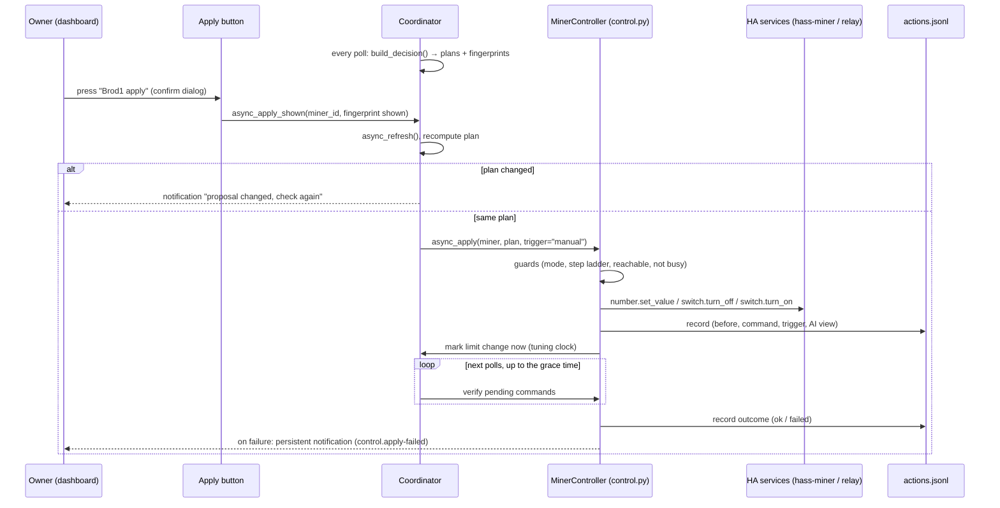

# feat: Semi-automatic apply: confirm each proposed action with a button

## Summary

The rules already work out a concrete plan for every miner on every cycle (set a power step,
stop, start or hold), but nothing carries it out. This plan adds the path that does: an
**Apply** button next to each proposed action, plus an **Apply all** button. Pressing one runs
the plan that is on screen, through one command path that checks it, sends the HA service
calls, verifies the result and logs it.

The owner stays in the loop for every change, so nothing unexpected happens while we learn
whether the plans can be trusted. The command path is built to be shared: **automatic mode
later is a toggle that calls the same function at the end of each cycle**, plus a few guards
that only automation needs (Phase 2, at the end). The buttons themselves don't change.

---

## Progress

Check off each unit after it is implemented, tested and committed.

**Phase 1: semi-automatic (this plan)**

- [ ] **S1**: Control mode setting: `Preview` / `Manual` (replaces the unused `dry_run` option)
- [ ] **S2**: Command executor (`control.py`): plan → HA service calls, with guards
- [ ] **S3**: What you saw is what runs: plan fingerprint, refresh and compare on press
- [ ] **S4**: Verify every command and finish a start (pending limit after power-on)
- [ ] **S5**: Action log (`actions.jsonl`): who applied what, before, after, result
- [ ] **S6**: Entities: per-miner "Proposed action" sensor and "Apply" button, hub "Apply all" button
- [ ] **S7**: Dashboard card: a "Proposed actions" section with confirm dialogs
- [ ] **S8**: Docs, knowledge base, wording ("preview only" is no longer always true)
- [ ] **S9**: First run on the real miners (manual checklist, below)

**Phase 2: automatic (later, not part of this plan)**

- [ ] **A1**: `Auto` control mode, same executor, called by the coordinator
- [ ] **A2**: Automation-only guards (hold time, change rate, schedule conflict, failure freeze)

---

## Where the product is today

| Area | State | What it means for this plan |
|---|---|---|
| Rule decision (`decision.py`) | Done, runs every poll. Produces a `MinerPlan` per miner: `set_limit` / `start` / `stop` / `hold`, with `limit_w`, `method` (relay or pause) and `target_entity_id`. | **The plan is already a command.** Nothing new to decide; we only carry it out. |
| Power steps, tuning, temperature, stop-below-lowest-step | Done in the rules. | Plans are already one step at a time, inside the miner's range, and never step up a tuning miner. |
| Entities to act on | Known per miner in `MinerSnapshot`: `power_limit_entity_id` (hass-miner `number`), `switch_entity_id` (hass-miner `active` = pause/resume), `relay_entity_id` (optional, from Configure). | The executor needs no new discovery. |
| `_async_apply_power_limit` in the coordinator | Exists from U11, tested, **never called**. Clamps to min/max and calls `number.set_value`. | Moves into the executor and gains the step check. |
| `CONF_DRY_RUN` option | In Configure, saved, **read by nothing**. | Replaced by the control mode (S1). |
| AI advice | Advisory only. Its actions are `increase/reduce/hold/stop/start` **without a wattage**. | **Not applied.** Only the rule plan is applied; the AI answer is shown next to it and logged for comparison (P0 `rule.guard-above-ai`). |
| Decision log sensor and card | Shows trace and plans; titled "preview, not applied". | Gets an apply section (S6, S7); the title changes with the mode. |
| Tuning tracking | `_limit_seen` notices a limit change on the next poll. | The executor marks the change at once, so the next cycle already counts the miner as tuning. |
| Schedule automation | Still pauses/resumes at 07:00 and 19:00 (`site.schedule-automation`). | Manual mode warns, it doesn't refuse (see Decisions). Auto mode will refuse. |
| Alerts `control.apply-failed`, `control.schedule-conflict` | Defined in `knowledge/alerts.yaml`, "only exist once decisions are applied". | S4 raises `apply-failed`; Phase 2 enforces `schedule-conflict`. |
| Parent plan U6 (miner control) | Unchecked. Designed around `SafetyDecision`/`AiDecision` and a dry-run bypass that no longer match the code. | **This plan replaces U6.** |

---

## Decisions (proposed, confirm or veto)

1. **Only the rule plan is applied.** The AI has no wattage in its answer, and the rules are the controller (requirements doc §0 point 1). The AI's view of the same miner is shown next to the button and recorded in the action log, so later we can see how often the owner applied a plan the AI disagreed with.
2. **The button applies exactly what was shown.** On press, the coordinator refreshes; if the plan for that miner changed, nothing runs and a notification says "the proposal changed, check again" (S3). No silent substitution.
3. **One command path for all triggers.** `async_apply(miner_id, plan, trigger)` with `trigger` = `manual` now, `auto` later. Everything (guards, service calls, verification, logging) lives behind it. Phase 2 adds guards there, not in the buttons.
4. **In Manual mode the schedule automation is a warning, not a block.** The owner is at the screen and is the one controller; refusing would make the button useless until the schedule is retired. Auto mode refuses (P0 `rule.one-controller`).
5. **Apply all runs reductions first**: stops and step-downs, then step-ups and starts, so the house never briefly draws both.
6. **Hold plans have no button.** The Apply button is unavailable (greyed out) when the plan is `hold`, when the mode is Preview, or while a command for that miner is still being verified.
7. **Safety plans are not special-cased in Phase 1.** A battery-floor stop is a plan like any other and waits for the button. Running safety plans without a press belongs to Phase 2.

---

## Scope

### In scope

- Control mode `Preview` / `Manual` (select entity and Configure).
- Executor for `set_limit`, `stop`, `start` (relay and pause methods).
- Per-miner Apply buttons and Apply all, with HA confirm dialogs on the generated card.
- Verification of every command, a pending limit after a start, the `control.apply-failed` notification.
- Action log on disk, with the last entries on a sensor attribute for the card.

### Not in scope

- Automatic applying (Phase 2).
- Applying AI answers.
- Hold-time and change-rate limits (the owner is the rate limit in Phase 1).
- Turning the schedule automation off from the integration.
- The `decision/` package split (requirements doc §11). The executor depends only on `MinerPlan`, so the split can happen independently.

---

## High-level design

*Directional; the implementer should follow the code style around it rather than copy this.*

**Plan → service call:**

| Plan | Method | Service call | Done when |
|---|---|---|---|
| `set_limit` | | `number.set_value` on `power_limit_entity_id`, value = `limit_w` | the number entity reads `limit_w` |
| `stop` | `relay` | `switch.turn_off` on the relay | relay reads `off` |
| `stop` | `pause` | `switch.turn_off` on the hass-miner `active` switch | switch reads `off` |
| `start` | `relay` / `pause` | `switch.turn_on` on the same entity, then a **pending limit** | switch `on`, then the number reads `limit_w` (S4) |
| `hold` | | nothing | n/a |

---

## Implementation units

### S1. Control mode

**Goal:** One setting that says whether the integration may touch the miners.

- `const.py`: `CONF_CONTROL_MODE`, `CONTROL_MODE_PREVIEW = "preview"`, `CONTROL_MODE_MANUAL = "manual"` (and the reserved `CONTROL_MODE_AUTO = "auto"`, not offered yet). Default `preview`, so an upgrade changes nothing until the owner chooses.
- `select.py`: `ControlModeSelect` next to `ProfileSelect`, same pattern (writes the option; the entry reloads).
- `config_flow.py`: replace the `CONF_DRY_RUN` checkbox with the control mode in the settings step. Saved `dry_run` values are ignored (it was never read), so no migration is needed. Remove the key from the schema.
- Coordinator exposes `control_mode` as a property for the entities.

**Tests:** select shows and writes the mode; the options flow saves it; the default is `preview`; the old `dry_run` option is no longer offered (update `test_options_flow_sets_dry_run` into a control-mode test rather than deleting it).

### S2. Command executor (`control.py`)

**Goal:** The single place that turns a `MinerPlan` into service calls. Both triggers use it.

- New `control.py` with `MinerController(hass)` and `async_apply(miner: MinerSnapshot, plan: MinerPlan, *, trigger: str, steps: list[float]) -> CommandResult`.
- `CommandResult`: `ok` / `refused` / `failed`, a reason, and the service calls made.
- **Guards, in order** (refuse with a reason, never raise into HA except `HomeAssistantError` for the button to show):
  1. Mode allows it (`manual` for `trigger="manual"`; Phase 2 adds `auto`).
  2. Plan is actionable (not `hold`).
  3. No command for this miner is still being verified (per-miner lock; protects against double presses).
  4. The target entity exists in `hass.states` and isn't `unavailable` (for `set_limit`: the number; for stop/start: the switch).
  5. P0 `rule.miner-range`: `limit_w` is on this miner's step ladder (`decision._ladder`) and inside its min/max. **Refuse, don't clamp**: a limit off the ladder means a bug upstream, and silently clamping would hide it.
- Moves `_async_apply_power_limit` out of the coordinator into `control.py`; its tests move with it and keep their cases (clamp-or-refuse change noted in the test names).
- After a successful `set_limit` or `start`, tells the coordinator to restart the miner's tuning clock now (`_limit_seen[miner_id] = (limit_w, now)`).
- `blocking=True` service calls, so a hass-miner error surfaces as a failed command.

**Tests:** each plan type makes the right call with the right entity; relay wins over pause; each guard refuses with its reason and makes no call; a service error gives `failed`; the tuning clock is set.

### S3. What you saw is what runs

**Goal:** A press never applies something different from the row the owner looked at.

- `MinerPlan.fingerprint` property: `action|limit_w|method|target_entity_id` (no reason text, so a reworded reason doesn't block).
- The per-miner "Proposed action" sensor exposes the fingerprint as an attribute; the button reads it **at press time from its own state**, which is what the dashboard showed.
- `coordinator.async_apply_shown(miner_id, fingerprint, trigger="manual")`: `await self.async_refresh()`, then compare the new plan's fingerprint with the shown one. Different: notification "Brod1: the proposal changed from X to Y, check again", log `refused: changed`. Same: call the executor.
- Refuse if the last coordinator update failed (`last_update_success` is false): stale readings are worse than no action.
- **Apply all**: refresh once, apply each miner whose plan is unchanged and actionable, reductions first (Decision 5); report the ones skipped.

**Tests:** unchanged plan runs; changed plan doesn't and notifies; failed refresh refuses; Apply all orders stops/step-downs before step-ups/starts and skips changed ones.

### S4. Verification and finishing a start

**Goal:** Know whether each command took, and finish a start, which takes two steps.

- The executor keeps `pending: dict[miner_id, PendingCommand]` (expected entity, expected state, deadline, and for a start the limit still to set).
- Each coordinator cycle calls `controller.async_check_pending(snapshot)`:
  - Expected state reached: log `ok`, release the lock.
  - Start, switch is `on`, the number entity is available: send `number.set_value` with the pending limit (only if different from what the miner already has), then wait for that.
  - Past the deadline (`APPLY_VERIFY_GRACE_S`, default 60 s as in the alert; **300 s for a relay start**, because the miner has to boot): log `failed`, release the lock, persistent notification under `control.apply-failed` (one per miner, replaced not stacked).
- Pending commands are memory only; after an HA restart they are gone and the log says nothing about their outcome. Accepted for Phase 1.

**Open, verify on hardware (S9):** does the hass-miner `number` accept a new limit while the miner is paused? If yes, a pause start can set the limit before resuming and skip the second step. The design above works either way.

**Tests:** ok path; timeout gives failed and a notification; a start sets the limit only after the switch is on and the number is available; a second press while pending is refused.

### S5. Action log

**Goal:** A record of what was applied. It is also the "outcome fields" the AI log has been waiting for (`open.ai-learning`).

- `actions.jsonl` next to `ai_log.jsonl`, same rotation. Pull the file writing out of `AiLog` into a small shared `JsonlLog` class (path, rotate, append, read tail) and use it for both, rather than copying it.
- One line per command event: `ts`, `trigger`, `miner`, `plan` (action, limit, method, reason), `before` (limit, power, temp, hashrate, stopped), `energy` (grid net, available, solar), `rule_summary`, `ai` (the AI's action for this miner from the latest advice, and its age), `result` (`ok` / `refused` / `failed` / `pending`), `reason`, `calls`.
- The outcome line (from S4) repeats `ts`, `miner` and a command id so the two can be joined.
- Last 20 entries in memory, shown as the `history` attribute of the new "Last action" sensor (S6).

**Tests:** one line per event with the fields above; rotation shared with the AI log still works (existing `test_ai_log.py` keeps passing); the AI's view is captured when there is advice and `null` when there isn't.

### S6. Entities

**Goal:** Something to press, next to the thing it applies.

- **Per miner** (added as miners appear, like `MinerSensor`):
  - Sensor `<miner> proposed action`: state is the short plan text (`1,300 W (from 1,100 W)`, `stop (pause)`, `start at 1,100 W`, `hold`). Attributes: `fingerprint`, `action`, `limit_w`, `reason`, `ai_action` (the AI's view of this miner), `pending` (a command in flight).
  - Button `<miner> apply`: `available` only when the mode is Manual, the plan is actionable and nothing is pending. Press → `async_apply_shown` with the fingerprint from the sensor's current state.
- **Hub:**
  - Button `Apply all proposals`: available when at least one miner has an actionable plan in Manual mode.
  - Sensor `Last action`: state is the last command and its result; `history` attribute from S5.
- The button text comes from HA (`PRESS`); the plan text is on the sensor row right above it.

**Tests:** availability in each mode and plan state; press passes the shown fingerprint; entities appear for a miner that shows up after start; unique ids stable.

### S7. Dashboard card

**Goal:** The "Add to dashboard" card gets a section where each proposal sits next to its button.

- New `Proposed actions` entities card in the generated vertical stack: for each miner, the proposed-action sensor row then its Apply button row; Apply all at the end; Last action below.
- Each button row uses `tap_action: {action: perform-action, perform_action: button.press, target: …, confirmation: {text: "Apply <miner>: <plan>?"}}`. The confirm text is static on the card, so it names the miner only. The plan itself is on the row above.
- The decision-log markdown title shows the mode: "Decision log (preview, not applied)" vs "Decision log (manual apply)".

**Tests:** extend `test_button.py` for the generated YAML: the section is there, buttons have a confirmation, the title follows the mode.

### S8. Docs, knowledge base, wording

- `protocols.py`, `decision.py`, `ai.py` docstrings say "preview only, never applied": change to "applied only through `control.py`, when the control mode allows it". The AI system prompt stays as is ("You cannot change anything" is still true of the AI).
- `DecisionLogSensor`/`AiAdviceSensor` `preview_only` attribute follows the mode.
- README: control mode, the buttons, the action log, the first-run checklist.
- Knowledge base: `rule.apply-by-hand-first` (added with this plan); in S4, update `control.apply-failed` (`note`: now raised by the executor); after S9, record what the hardware did (pause+limit behaviour, how long a relay start took) as `verified` entries in `miners.yaml`.
- Parent plan: U6 points here (done with this plan).
- Version bump (minor) in `manifest.json`.

### S9. First run on the real miners

Not code; a checklist the owner runs and the result goes into the knowledge base.

1. Mode `Preview`: nothing can be pressed; card says preview.
2. Mode `Manual`, midday, one miner, a step-down the rules propose: press, watch the number change, check `actions.jsonl` has the `pending` then `ok` lines, and that the next cycle treats the miner as tuning.
3. A step-up on the same miner after it has settled.
4. A stop with the pause method, then a start: note whether the limit could be set while paused (S4 open point) and how long until it's back.
5. Wait for a plan to change between looking and pressing (or force it by changing the profile): confirm the refusal notification.
6. Pull the network/turn the miner off and press: confirm `failed` after the grace time and the notification.
7. Apply all with two miners moving opposite ways: reductions go first.
8. Record the results in `miners.yaml` / `alerts.yaml`; settle `open.go-live-evidence` with what the manual phase shows.

---

## Phase 2: automatic mode (later)

What the toggle needs on top of Phase 1. Listed so Phase 1 doesn't paint it into a corner.

- **A1. `Auto` mode.** The control-mode select gains `Auto`. At the end of `_async_update_data`, when the mode is Auto, the coordinator calls `controller.async_apply(…, trigger="auto")` for every actionable plan, in the Apply-all order. No fingerprint check is needed: the plan is fresh by construction. The buttons stay as a manual override in every mode.
- **A2. Guards that only automation needs** (all in `control.py`, keyed by `trigger == "auto"`):
  - Minimum hold time per miner (requirements doc §5.2) and a cap on changes per hour.
  - A plan must be the same for N cycles before it runs (flapping guard; replaces the human's judgement).
  - `control.schedule-conflict`: a setting naming the schedule automation; refuse while it is on (P0 `rule.one-controller`).
  - `control.apply-failed` freezes automatic applying until a human acknowledges it.
  - Safety plans (battery floor, voltage when it exists) run without waiting.
- **Evidence to switch it on** comes from the Phase 1 action log: how many plans the owner applied as shown, how many were skipped, how many were reversed within an hour (`open.go-live-evidence`).

---

## Risks

| Risk | Mitigation |
|---|---|
| A press applies an outdated plan | Refresh and fingerprint compare on press (S3); refuse after a failed update. |
| Double press or Apply all plus a single press | Per-miner pending lock (S2/S4). |
| hass-miner rejects the value, or the miner is unreachable | `blocking=True` call, verification with a deadline, notification (S4). |
| A limit off the step ladder reaches a miner | Refuse in the executor (S2), never clamp silently. |
| The schedule automation undoes a manual action at 07:00/19:00 | Warning in Manual mode; the owner retires the schedule before Auto (A2). |
| HA restarts mid-command | The pending state is lost; the next cycle's plan shows reality. The log line stays `pending`; accepted for Phase 1. |
